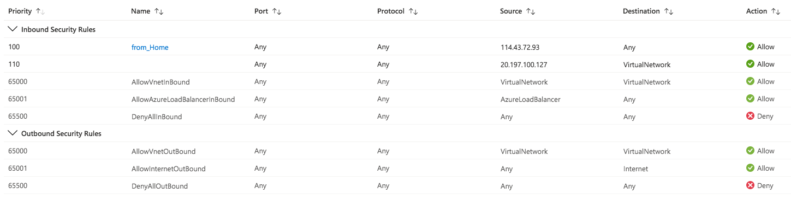

# Azure Load Balancer components
## Frontend IP
<br>

## Backend pool
## Health probes
## Load Balancer rules
<br>

- On Azure, Floating IP should enable
    <br>
- On OS, [Floating IP Guest OS configuration](https://docs.microsoft.com/en-us/azure/load-balancer/load-balancer-floating-ip#floating-ip-guest-os-configuration)
    - [Linux 绑定 IP 与 net.ipv4.ip_nonlocal_bind 不存在](https://www.igiftidea.com/article/11556082942.html)
    - 設定 IP forward 和 bind 不存在的 IP
        ```bash
        echo net.ipv4.ip_forward = 1 >> /etc/sysctl.conf
        echo net.ipv4.ip_nonlocal_bind=1 >> /etc/sysctl.conf
        sysctl -p
        ```
    - [安裝流量监控](https://www.geeksforgeeks.org/how-to-install-nload-in-linux/)
        ```bash
        yum install epel-release -y
        yum install iftop -y
        ```
        - `tcpdump | grep -vE "168.63.129.16|169.254.169.254|https" | grep http`
            1. 20:42:06.327395 IP 114-43-72-93.dynamic-ip.hinet.net.49993 > 20.212.147.113.http: Flags [S], seq 2348462565, win 65535, options [mss 1452,nop,wscale 5,nop,nop,TS val 1038367230 ecr 0,sackOK,eol], length 0
            2. 20:42:06.327450 IP t-nva.internal.cloudapp.net.49993 > t-web.internal.cloudapp.net.http: Flags [S], seq 2348462565, win 65535, options [mss 1452,nop,wscale 5,nop,nop,TS val 1038367230 ecr 0,sackOK,eol], length 0
            3. 20:42:06.328781 IP t-web.internal.cloudapp.net.http > t-nva.internal.cloudapp.net.49993: Flags [S.], seq 4006893232, ack 2348462566, win 28960, options [mss 1418,sackOK,TS val 359806 ecr 1038367230,nop,wscale 7], length 0
            4. 20:42:06.328805 IP 20.212.147.113.http > 114-43-72-93.dynamic-ip.hinet.net.49993: Flags [S.], seq 4006893232, ack 2348462566, win 28960, options [mss 1418,sackOK,TS val 359806 ecr 1038367230,nop,wscale 7], length 0
    - [設定 reverse proxy](https://www.maxlist.xyz/2020/06/18/flask-nginx/)
        - `yum install nginx -y`
        - `systemctl start nginx.service; systemctl enable nginx.service`
        - `nginx -t`
            - 檢查格式
        - `nginx -s reload`
            - 參數 reload 後生效
        - `vi /etc/nginx/nginx.conf`
            ```conf
            # virtualhost for t-web.southeastasia.cloudapp.azure.com
            server {
                listen      80 default_server;
                listen [::]:80 default_server;
                server_name  t-web.southeastasia.cloudapp.azure.com;
                location / {
                    # 反向代理到 t-web 主機的 80 port
                    proxy_pass http://t-web;

                    # 把 ip、protocol 等 header 都一起送給反向代理的 server
                    proxy_set_header Host $host;
                    proxy_set_header X-Real-IP $remote_addr;
                    proxy_set_header X-Forwarded-For $proxy_add_x_forwarded_for;
                    proxy_set_header X-Forwarded-Proto $scheme;
                    #index index.html index.htm;
                }
            }
            ```
    - [設定 iptables](http://www.noobyard.com/article/p-urmalkcy-t.html)
        - `vi /etc/sysconfig/iptables`
    - [設定 forwarding rule](https://docs.microsoft.com/en-us/azure/data-factory/tutorial-managed-virtual-network-on-premise-sql-server#creating-forwarding-rule-to-endpoint)
        - `wget https://raw.githubusercontent.com/sajitsasi/az-ip-fwd/main/ip_fwd.sh`
        - public ip
            - `~/ip_fwd.sh -i eth0 -f 80 -a t-web.southeastasia.cloudapp.azure.com -b 80` (待驗證)
        - private ip
            - `~/ip_fwd.sh -i eth0 -f 80 -a t-web -b 80`
            - `~/ip_fwd.sh -i eth0 -f 80 -a t-zbx -b 80` (待驗證)
            - `~/ip_fwd.sh -i eth0 -f 81 -a t-zbx -b 80` (待驗證)
        - check
            - `iptables -t nat -v -L PREROUTING -n --line-number`
        - save rule
            - `iptables-save`
        - delete rule
            - `iptables -t nat -D PREROUTING 1` (待驗證)
    - [設定 loopback address](https://leoprosoho.pixnet.net/blog/post/27398897)
        ```conf
        DEVICE=lo
        IPADDR=127.0.0.1
        NETMASK=255.0.0.0
        NETWORK=127.0.0.0
        BROADCAST=127.255.255.255
        ONBOOT=yes
        NAME=loopback

        DEVICE=lo:1
        IPADDR=10.1.87.100
        NETMASK=255.255.255.0
        NETWORK=10.1.87.0
        BROADCAST=10.1.87.255
        ONBOOT=yes
        NAME=loopback1
        ```
        - systemctl restart network

## NSG
<br>