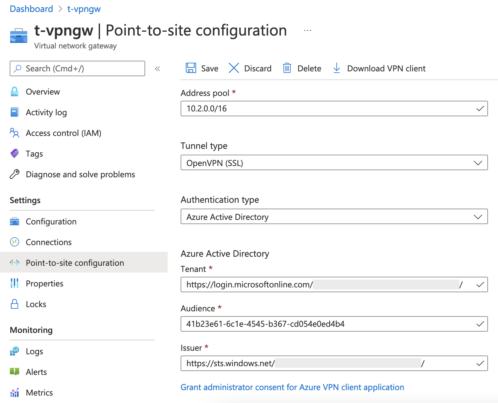

# Price & Licence
- [VPN Gateway pricing](https://azure.microsoft.com/en-us/pricing/details/vpn-gateway/#pricing)
- [Feature comparison based on AAD licenses](https://docs.microsoft.com/en-us/azure/active-directory/authentication/concept-mfa-licensing#feature-comparison-based-on-licenses)

# What protocol does P2S use?
Point-to-site VPN can use one of the following protocols:
- OpenVPN® Protocol, an SSL/TLS based VPN protocol. A TLS VPN solution can penetrate firewalls, since most firewalls open **TCP port 443 outbound**, which TLS uses. OpenVPN can be used to connect from Android, iOS (versions 11.0 and above), Windows, Linux, and Mac devices (macOS versions 10.13 and above).
- Secure Socket Tunneling Protocol (SSTP), a proprietary TLS-based VPN protocol. A TLS VPN solution can penetrate firewalls, since most firewalls open TCP port 443 outbound, which TLS uses. SSTP is only supported on Windows devices. Azure supports all versions of Windows that have SSTP and support TLS 1.2 (Windows 8.1 and later).
- IKEv2 VPN, a standards-based IPsec VPN solution. IKEv2 VPN can be used to connect from Mac devices (macOS versions 10.11 and above).

# P2S OpenVPN protocol connections
When you connect to your VNet using Azure VPN Gateway P2S, you have a choice of which protocol to use. The protocol you use determines the authentication options that are available to you. If you want to use AAD authentication, you can do so when using the OpenVPN protocol. This article helps you set up an AAD tenant.
- [Create an Azure AD tenant for P2S OpenVPN protocol connections](https://docs.microsoft.com/en-us/azure/vpn-gateway/openvpn-azure-ad-tenant)
    - AAD authentication is supported for [OpenVPN](https://zh.wikipedia.org/wiki/OpenVPN) protocol connections only and requires the Azure VPN client.
    - The Basic SKU is not supported for OpenVPN.
- Azure AD authentication
    - [Windows](https://docs.microsoft.com/en-us/azure/vpn-gateway/openvpn-azure-ad-client)
        - Windows 10/11
    - [macOS](https://docs.microsoft.com/en-us/azure/vpn-gateway/openvpn-azure-ad-client-mac)
        - macOS 10.15

# P2S configuration
## Address pool
The client address pool is a range of private IP addresses that you specify. The clients that connect over a Point-to-Site VPN dynamically receive an IP address from this range. Use a private IP address range that **doesn't overlap with** the on-premises location that you connect from, or the VNet that you want to connect to.
 