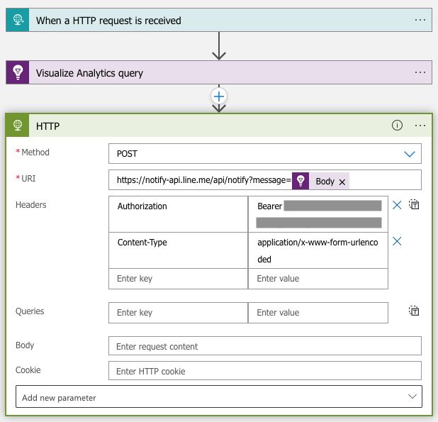

# 目的
對外網頁服務網站回應需在 2 秒內，確保服務水準

# 架構
使用 Application Insights 的 Availability Test 監控，透過多個不同地理區域，偵測網站回應時間，並將不合規的結果透過 Line 發送推播

# 步驟
1. Line token
    - https://notify-bot.line.me/my/
2. Logic App
    - When a HTTP request is received
        <br>
        <br>
    - Visualize Analytics query
        - Application Insights ➡ API Access ➡ Create API key
            - 取得 `API Key` 與 `Application Id`
            - API key description: `監控 DMZ Web 回應狀態`
            - Read telemetry: `打勾`
        - Query (未完成...)
            ```kusto
            availabilityResults
            | where name == 'zabbix'
            | where duration > 2
            | project name,duration
            | top 1 by duration desc
            ```
        <br>
        <br>
    - HTTP
        - Method: `POST`
        - URI: `https://notify-api.line.me/api/notify?message=顯示的訊息`
        - Header
            - Authorization: `Bearer <Line Token>`
            - Content-Type: `application/x-www-form-urlencoded`
        <br>

3. Application Insights
    - Availability ➡ Availability Test
    - Create Standard (preview) test
        - Test frequency
        - Test locations
        - Succuess criteria
            - Test timeout
                - 預設最小 30 秒
                - 去 https://resources.azure.com/ 改成以下參數 "Timeout": 2 (秒)
    - Open Rules (Alerts) page
        - Actions
            - URI: `https://prod-07.southeastasia.logic.azure.com:443/workflows/XXX/triggers/manual/paths/...XXX`
        <br>
4. 推播結果
    <br>

# 參考
- [[Azure] 將Azure Monitor的訊息發送至LINE推播上](https://dotblogs.com.tw/maduka/2020/06/21/204512)
- [Automate Application Insights processes by using Logic Apps](https://docs.microsoft.com/en-us/azure/azure-monitor/app/automate-with-logic-apps)