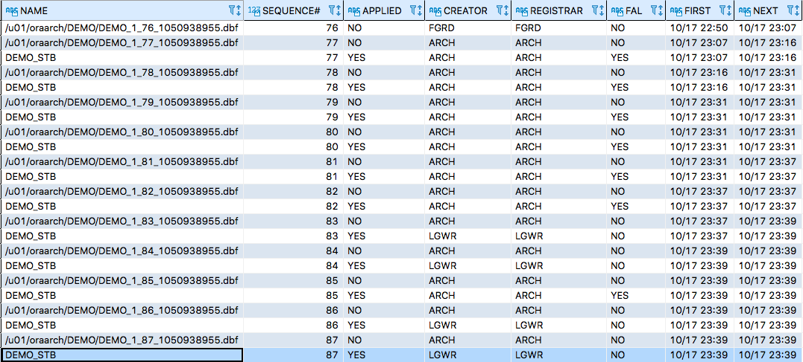

# Data Guard
- Maximum Protection: primary 和 standby sync 後，priamry 才能繼續作業
- Maximum Availability
- Maximum Performance

## RMAN
### backup on primary
- `vi restart_primary.sh`
    ```bash
    #/bin/bash
    $ORACLE_HOME/bin/sqlplus / as sysdba << EOF
    shutdown immediate
    startup
    quit
    EOF
    ```
- `vi backup_primary.sh`
    ```bash
    #!/bin/bash
    source ~/.bash_profile
    TODAY=`date +%Y-%m-%d`
    BKDIR="/backup/$TODAY"
    mkdir -p $BKDIR
    $ORACLE_HOME/bin/rman target / nocatalog << EOF
    run {
        allocate channel d1 type disk;

        #-- backup database
        backup as compressed backupset
            incremental level 0
            check logical
            database format '$BKDIR/%d_%s_%p_%t.bak';

        #-- backup archive log
        backup as compressed backupset
            archivelog all format '$BKDIR/%d_arch_%s_%p_%t.bak';
            delete force noprompt copy of archivelog all completed before 'sysdate-1';

        #-- backup control file
        backup
            format '$BKDIR/%d_cntl_%s_%p_%t.bak'
            current controlfile;

        release channel d1;
    }
    EOF
    ```
    - 保留一天以內的 archive log

### restore on standby
- `vi open_stb.sh`
    ```bash
    #/bin/bash
    $ORACLE_HOME/bin/sqlplus / as sysdba << EOF
    shutdown immediate
    create spfile from pfile;
    startup mount
    alter database recover managed standby database disconnect from session;
    quit
    EOF
    ```
- `vi restart_stb.sh`
    ```bash
    #/bin/bash
    $ORACLE_HOME/bin/sqlplus / as sysdba << EOF
    alter database recover managed standby database cancel;
    shutdown immediate
    startup mount
    alter database recover managed standby database disconnect;
    quit
    EOF
    ```
- `vi restore.sh`
    ```bash
    #!/bin/bash
    $ORACLE_HOME/bin/rman target / nocatalog << EOF
    run {
        startup nomount;
        restore standby controlfile from '/backup/2020-11-19/ERP_cntl_21_1_1056917987.bak';
        alter database mount;
        restore database until time "to_date('2020/11/19 20:20', 'YYYY/MM/DD HH24:MI')";
        recover database until time "to_date('2020/11/19 20:20', 'YYYY/MM/DD HH24:MI')";
    }
    EOF
    ```
    - 注意還原時間

### duplicate from primary to standby
- `vi duplicate.sh`
    ```bash
    #!/bin/bash
    $ORACLE_HOME/bin/rman target sys/oracle@ERP nocatalog auxiliary / log=~/duplicate_20201118.log << EOF
    run {
        set until time "to_date('2020/11/18 22:00', 'YYYY/MM/DD HH24:MI')";
        duplicate target database to "ERP" nofilenamecheck;
    }
    EOF
    ```

## listener.ora
### primary
```
LISTENER =
    (DESCRIPTION_LIST =
        (DESCRIPTION =
            (ADDRESS = (PROTOCOL = TCP)(HOST = primary)(PORT = 1521))
        )
    )

SID_LIST_LISTENER =
    (SID_LIST =
        (SID_DESC =
            (SID_NAME = DEMO)
            (ORACLE_HOME = /u01/oracle/11204)
        )
    )

## Automatic Diagnostic Repository
ADR_BASE_LISTENER = /u01/oracle
```

### standby
```
LISTENER =
    (DESCRIPTION_LIST =
        (DESCRIPTION =
            (ADDRESS = (PROTOCOL = TCP)(HOST = standby)(PORT = 1521))
        )
    )

SID_LIST_LISTENER =
    (SID_LIST =
        (SID_DESC =
            (SID_NAME = DEMO)
            (ORACLE_HOME = /u01/oracle/11204)
        )
    )

## Automatic Diagnostic Repository
ADR_BASE_LISTENER = /u01/oracle
```

## tnsname.ora
### primary and standby
```
DEMO =
    (DESCRIPTION =
        (ADDRESS =
            (PROTOCOL = TCP)(HOST = primary)(PORT = 1521)
        )
        (CONNECT_DATA =
            (SERVER = DEDICATED)
            (SERVICE_NAME = DEMO)
        )
    )

DEMO_STB =
    (DESCRIPTION =
        (ADDRESS =
            (PROTOCOL = TCP)(HOST = standby)(PORT = 1521)
        )
        (CONNECT_DATA =
            (SERVER = DEDICATED)
            (SERVICE_NAME = DEMO)
        )
    )
```

## Parameter
### init[DEMO].ora
```
##### main config #####
*.audit_file_dest='/u01/oracle/admin/DEMO/adump'
*.audit_trail='db'
*.compatible='11.2.0.0.0'
*.control_files='/u01/oradata/DEMO/control01.ctl','/u01/oradata/DEMO/control02.ctl'
*.db_block_size=8192
*.db_domain='world'
*.db_name='DEMO'
*.diagnostic_dest='/u01/oracle'
*.dispatchers='(PROTOCOL=TCP) (SERVICE=DEMOXDB)'
*.log_archive_dest_1='LOCATION=/u01/oraarch'
*.log_archive_format='DEMO-%t_%s_%r.dbf'
*.memory_target=1588592640
*.open_cursors=300
*.processes=150
*.remote_login_passwordfile='EXCLUSIVE'
#*.undo_tablespace='UNDOTBS1'

IFILE=/u01/oracle/11204/dbs/initDEMO_ifile.ora
```

### primary ifile
```
##### data guard config #####
*.db_unique_name='DEMO'
#*.fal_server='DEMO' # where to get archived logs
*.job_queue_processes=1000
*.log_archive_config='DG_CONFIG=(DEMO,DEMO_STB)'
*.log_archive_dest_2='SERVICE=DEMO_STB NOAFFIRM ASYNC VALID_FOR=(ALL_LOGFILES,PRIMARY_ROLE) DB_UNIQUE_NAME=DEMO_STB COMPRESSION=ENABLE'
*.log_archive_dest_state_2='ENABLE'
*.log_archive_min_succeed_dest=1
*.standby_file_management='AUTO'
```

### standby ifile
```
##### data guard config #####
*.db_unique_name='DEMO_STB'
*.fal_server='DEMO'
*.job_queue_processes=0
*.log_archive_config='DG_CONFIG=(DEMO,DEMO_STB)'
*.log_archive_dest_2='SERVICE=DEMO NOAFFIRM ASYNC VALID_FOR=(ALL_LOGFILES,PRIMARY_ROLE) DB_UNIQUE_NAME=DEMO COMPRESSION=ENABLE'
*.log_archive_dest_state_2='DEFER'
*.log_archive_min_succeed_dest=1
*.log_file_name_convert='dummy','dummy'
*.standby_file_management='AUTO'
```

## check command
### Update spfile
```sql
create spfile from pfile;
```

### Primary
```sql
alter database force logging;
alter system switch logfile;
```

### Standby
```sql
startup nomount
alter database mount standby database;
alter database recover managed standby database disconnect from session;
```

### Check
#### Software
```sql
-- 增加視窗寬度
set linesize 120
set columnsize 300

-- sequence and & applied redo log(standby: redo apply YES)
select
    name,
    sequence#,
    applied,
    creator,
    registrar,
    FAL,
    to_char(first_time,'mm/dd hh24:mi') as first,
    to_char(next_time,'mm/dd hh24:mi') as next
from v$archived_log
--where first_time >= to_date('2020-12-20 12:00','yyyy-mm-dd hh24:mi')
order by first_time;

-- primary DB archive status
select * from v$archive_dest_status where status != 'INACTIVE';

-- switchover status(primary: TO STANDBY; standby: NOT ALLOWED)
select name, open_mode, database_role, switchover_status from v$database;

-- there are missing archive logs on the standby database server(no selected rows is right)
select * from v$archive_gap;
```


#### Hardware
```bash
ping [IP]
telnet [IP] [port]
traceroute [IP]
tnsping [ORACLE_SID]
```

#### Archive log sync success information
- standby
    ```
    Media Recovery Log /u01/oraarch/DEMO/DEMO_1_24_1050938955.dbf
    RFS[29]: Selected log 4 for thread 1 sequence 11574 dbid 244859031 branch 1034179942
    ```

## Debug
### Archive gap sequence
```sql
-- 確認是否有 gap
select thread#, low_sequence#, high_sequence# from v$archive_gap;

-- 找出最小 SCN on standby
select to_char(current_scn) from v$database;
    /*
    TO_CHAR(CURRENT_SCN)
    ----------------------------------------
    XXXXXXXX
    */

-- 確認 primary 沒有在 update datafile
select file#,name from v$datafile where creation_change# >= XXXXXXXX;

-- 停止 redo apply from primary to standby
alter database recover managed standby database cancel;

-- incremental backup on primary (RMAN)
backup incremental from scn XXXXXXXX database format '/backup_new/resovle-archive-gap/%d_%u.bak';

-- create standby controlfile on primary (RMAN, option)
backup format '/backup_new/resovle-archive-gap/%d_%U_stbctl.bak' current controlfile;

-- backup files 複製到 standby
scp -r -l 30000 /backup_new/resovle-archive-gap/ demo@standby:/backup_new/

-- recover standby (RMAN)
startup nomount
restore standby controlfile from '/backup_new/resovle-archive-gap/DEMO_71v61r4r_1_1_stbctl.bak';
alter database mount;
recover database noredo; -- because the online redo logs are lost, you must specify the NOREDO option in the RECOVER command

-- 重開 DB，執行 redo apply on standby (RMAN)
shutdown immediate
startup mount
alter database recover managed standby database disconnect from session;

-- switch redo log on primary (RMAN)
alter system switch logfile;
```

### Change standby to primary database
```sql
-- initiate the failover operation on the target standby database.
alter database recover managed standby database finish;

-- convert standby database to the primary role.
alter database commit to switchover to primary;

-- 重啟 the new primary database.
shutdown immediate
startup
```

## Simulation
- 交易: `alter system archive log current;`

## DR SOP
[Oracle 11gR2 DataGuard switchover 切換的兩個錯誤狀態解決](https://www.twblogs.net/a/5b9581282b717750bda4ecb2)
### Switchover(not verification)
1. 在主庫端檢查資料庫可切換狀態: `select switchover_status from v$database;`
    - TO STANDBY: 可以正常切換
    - SESSIONS ACTIVE: 當前有會話處於 active 狀態
2. 開始主庫正常切換
    - TO STANDBY:      `alter database commit to switchover to physical standby;`
    - SESSIONS ACTIVE: `alter database commit to switchover to physical standby with session shutdown;`
3. 重啟先前的主庫:
    - `shutdown immediate`
    - `startup mount`
4. 這時候在**備庫**驗證可切換狀態
    - TO PRIMARY: `select switchover_status from v$database;`
5. 將目標**備庫**轉換為主庫
    - TO STANDBY:      `alter database commit to switchover to primary;`
    - SESSIONS ACTIVE: `alter database commit to switchover to primary with session shutdown;`
6. 重啟目標**備庫**
    - `shutdown immediate`
    - `startup mount`
7. 主庫啟動日誌傳送程序: `alter database recover managed standby database disconnect;`(啟動MRP，sync 機制)
8. 檢查主、備庫角色狀態: `select switchover_status,database_role from v$database;`

### Failover
此時主庫異常跳電、硬體故障，無法執行資料庫作業(可 kill -9 SID 來測試)，可參考 https://codertw.com/%E8%B3%87%E6%96%99%E5%BA%AB/127062/
```
Sun Sep 13 11:42:49 2020
RFS[4]: Possible network disconnect with primary database
Sun Sep 13 11:42:49 2020
RFS[2]: Possible network disconnect with primary database
Sun Sep 13 11:42:49 2020
RFS[3]: Possible network disconnect with primary database
Sun Sep 13 11:42:49 2020
RFS[5]: Assigned to RFS process 3207
RFS[5]: Possible network disconnect with primary database
Sun Sep 13 11:42:51 2020
Error 1034 received logging on to the standby
FAL[client, USER]: Error 1034 connecting to DEMO for fetching gap sequence
```
1. 停止**備庫** redo log: `recover managed standby database cancel;`(PHYSICAL STANDBY, NOT ALLOWED)
    ```
    Sun Sep 13 11:51:47 2020
    ALTER DATABASE RECOVER  managed standby database cancel
    Sun Sep 13 11:51:48 2020
    MRP0: Background Media Recovery cancelled with status 16037
    Errors in file /u01/oracle/diag/rdbms/demo_stb/DEMO/trace/DEMO_pr00_3277.trc:
    ORA-16037: user requested cancel of managed recovery operation
    Recovery interrupted!
    Sun Sep 13 11:51:48 2020
    MRP0: Background Media Recovery process shutdown (DEMO)
    Managed Standby Recovery Canceled (DEMO)
    Completed: ALTER DATABASE RECOVER  managed standby database cancel
    ```
2. 結束**備庫** redo log: `alter database recover managed standby database finish [force];`(PHYSICAL STANDBY, TO PRIMARY)
    ```
    Sun Sep 13 11:57:56 2020
    alter database recover managed standby database finish
    Attempt to do a Terminal Recovery (DEMO)
    Media Recovery Start: Managed Standby Recovery (DEMO)
    started logmerger process
    Sun Sep 13 11:57:56 2020
    Managed Standby Recovery not using Real Time Apply
    Parallel Media Recovery started with 2 slaves
    Media Recovery Waiting for thread 1 sequence 25
    Begin: Standby Redo Logfile archival
    End: Standby Redo Logfile archival
    Terminal Recovery timestamp is '09/13/2020 11:57:57'
    Terminal Recovery: applying standby redo logs.
    Terminal Recovery: thread 1 seq# 25 redo required
    Media Recovery Waiting for thread 1 sequence 25
    Terminal Recovery: End-Of-Redo log allocation
    Terminal Recovery: standby redo logfile 4 created '/u01/oraarch/DEMO/DEMO_1_0_1050938955.dbf'
    This standby redo logfile is being created as part of the
    failover operation.  This standby redo logfile should be
    deleted after the switchover to primary operation completes.
    Media Recovery Log /u01/oraarch/DEMO/DEMO_1_0_1050938955.dbf
    Terminal Recovery: log 4 reserved for thread 1 sequence 25
    Recovery of Online Redo Log: Thread 1 Group 4 Seq 25 Reading mem 0
    Mem# 0: /u01/oraarch/DEMO/DEMO_1_0_1050938955.dbf
    Identified End-Of-Redo (failover) for thread 1 sequence 25 at SCN 0xffff.ffffffff
    Incomplete Recovery applied until change 1085255 time 09/13/2020 11:29:49
    Media Recovery Complete (DEMO)
    Terminal Recovery: Enabled archive destination LOG_ARCHIVE_DEST_2
    Terminal Recovery: successful completion
    Forcing ARSCN to IRSCN for TR 0:1085255
    Sun Sep 13 11:57:57 2020
    ARCH: Archival stopped, error occurred. Will continue retrying
    ORACLE Instance DEMO - Archival Error
    Attempt to set limbo arscn 0:1085255 irscn 0:1085255
    ORA-16014: log 4 sequence# 25 not archived, no available destinations
    ORA-00312: online log 4 thread 1: '/u01/oraarch/DEMO/DEMO_1_0_1050938955.dbf'
    Resetting standby activation ID 3795058697 (0xe2340009)
    Completed: alter database recover managed standby database finish
    ```
3. 進行**備庫** switchover: `alter database commit to switchover to primary with session shutdown;`(PRIMARY, NOT ALLOWED)
    ```
    Sun Sep 13 11:59:51 2020
    alter database commit to switchover to primary with session shutdown
    ALTER DATABASE SWITCHOVER TO PRIMARY (DEMO)
    Maximum wait for role transition is 15 minutes.
    Backup controlfile written to trace file /u01/oracle/diag/rdbms/demo_stb/DEMO/trace/DEMO_ora_7381.trc
    Standby terminal recovery start SCN: 1085254
    RESETLOGS after incomplete recovery UNTIL CHANGE 1085255
    Online log /u01/oradata/DEMO/redo01.log: Thread 1 Group 1 was previously cleared
    Online log /u01/oradata/DEMO/redo02.log: Thread 1 Group 2 was previously cleared
    Online log /u01/oradata/DEMO/redo03.log: Thread 1 Group 3 was previously cleared
    Standby became primary SCN: 1085253
    Sun Sep 13 11:59:51 2020
    Setting recovery target incarnation to 3
    Switchover: Complete - Database mounted as primary
    Completed: alter database commit to switchover to primary with session shutdown
    ```
4. 開啟**備庫**: `alter database open;`(PRIMARY, FAILED DESTINATION)
5. 此時 standby 還缺少 primary archive log