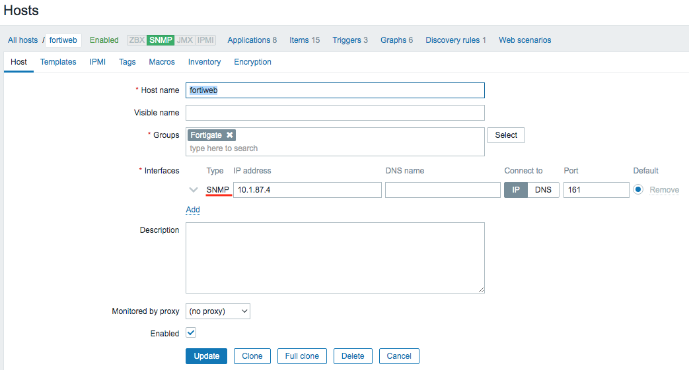

- [Update and Install Package](#update-and-install-package)
  - [Update repo](#update-repo)
  - [Install Package](#install-package)
- [Step](#step)
- [Template](#template)
- [如果要修改參數](#如果要修改參數)

## Reference
- [1-1.監控工具之一:Zabbix Server](https://ithelp.ithome.com.tw/articles/10190611)
- [CentOS 7 使用 YUM 安裝升級 MariaDB 到指定新版本](https://www.footmark.info/linux/centos/centos7-yum-update-mariadb/)
- https://www.digitalocean.com/community/tutorials/how-to-install-and-configure-zabbix-to-securely-monitor-remote-servers-on-centos-7
- https://www.zabbix.com/download?zabbix=5.0&os_distribution=centos&os_version=7&db=mysql&ws=apache

# Update and Install Package
## Update repo
- `vi /etc/yum.repos.d/MariaDB.repo`
    ```
    [mariadb]
    name = MariaDB
    baseurl = http://yum.mariadb.org/10.4/centos7-amd64
    gpgkey=https://yum.mariadb.org/RPM-GPG-KEY-MariaDB
    gpgcheck=1
    ```
- `vi /etc/yum.repos.d/zabbix.repo`
    ```
    [zabbix-frontend]
    ...
    enabled=1
    ...
    ```

## Install Package
```bash
rpm -Uvh https://repo.zabbix.com/zabbix/5.0/rhel/7/x86_64/zabbix-release-5.0-1.el7.noarch.rpm

timedatectl set-timezone Asia/Taipei
sed -i 's/^SELINUX=enforcing$/SELINUX=permissive/' /etc/selinux/config

yum update -y
yum install telnet -y
yum install zabbix-server-mysql zabbix-agent -y
yum install centos-release-scl -y
yum install zabbix-web-mysql-scl zabbix-apache-conf-scl -y
yum install mariadb mariadb-server -y
yum install httpd -y
yum install php-bcmath php-mbstring php-xml curl curl-devel net-snmp net-snmp-devel net-snmp-utils perl-DBI -y
```

# Step
- server
    - `systemctl start mariadb; systemctl enable mariadb`
    - `mysql -uroot -p`
        - 直接按 enter
        - MariaDB [(none)]>
            ```sql
            create database zabbix character set utf8 collate utf8_bin;
            create user zabbix@localhost identified by 'manager1';
            grant all privileges on zabbix.* to zabbix@localhost;
            quit;
            ```
    - `zcat /usr/share/doc/zabbix-server-mysql*/create.sql.gz | mysql -uzabbix -p zabbix`
        - 輸入密碼: manager1
    - `vi /etc/opt/rh/rh-php72/php-fpm.d/zabbix.conf` (找不到在哪)
        ```
        ...
        php_value[date.timezone] = Asia/Taipei
        ...
        ```
    - `vi /etc/zabbix/zabbix_server.conf`
        ```
        DBHost=localhost
        DBName=zabbix
        DBUser=zabbix
        DBPassword=manager1
        ```
    - `systemctl restart zabbix-server zabbix-agent httpd rh-php72-php-fpm`
    - `systemctl enable zabbix-server zabbix-agent httpd rh-php72-php-fpm`
    - http://[zabbix_server_ip]/zabbix
        - 預設帳密: Admin/zabbix
- agent
    - `yum install zabbix-agent -y`
    - `vi /etc/zabbix/zabbix_agentd.conf`
        ```
        Server=[zabbix_server_ip]
        ```
    - `systemctl enable zabbix-agent`
    - `systemctl restart zabbix-agent`

# Template
- [SQL Server template](https://share.zabbix.com/databases/microsoft-sql-server/template-for-microsoft-sql-server)
- FortiWeb
    - [Fortigate SNMP template](https://share.zabbix.com/network_devices/fortigate/fortigate-snmp-template)
    - 命令
        - 開啟 SNMP 服務
            - `systemctl start snmpd; systemctl enable snmpd`
            - `service snmpd start; chkconfig snmpd on`
        - 安裝 MIB (管理資訊庫)
            - `yum install net-snmp-libs -y`
            - `yum install net-snmp-utils -y`
        - 測試目標主機狀況
            - `snmpwalk -v 2c -c public 10.1.87.4`
            - `snmpwalk -v 2c -c public <fortiweb_host_name>`
        - 檢查目標主機 SNMP UDP 有無開啟
            - `nc -zvu 10.1.87.4 161`
        - config
            ```
            #com2sec notConfigUser  default       public
            com2sec local localhost public
            com2sec mynetwork snmp_server_ip public

            #group   notConfigGroup v1           notConfigUser
            #group   notConfigGroup v2c           notConfigUser
            group MyRWGroup v1 local
            group MyRWGroup v2c local
            group MyROGroup v1 mynetwork
            group MyROGroup v2c mynetwork

            ##           incl/excl subtree                          mask
            view all    included  .1                               80

            #access MyROGroup ""      any       noauth    0      all    none   none
            #access MyRWGroup ""      any       noauth    0      all    all    all
            access MyROGroup "" any noauth prefix all none none
            access MyRWGroup "" any noauth prefix all all all

            #syslocation Unknown (edit /etc/snmp/snmpd.conf)
            #syscontact Root <root@localhost> (configure /etc/snmp/snmp.local.conf)
            syslocation GangShan
            syscontact Root (configure /etc/snmp/snmp.local.conf)

            #proc mountd
            proc snmpd
            ```
    - Web UI
        - zabbix 匯入 template (SNMP)
            <br>
    - 參考
        - [1-8.監控工具之一:Zabbix Snmp 網通設備資料收集](https://ithelp.ithome.com.tw/articles/10191378)
        - [官方博文 | 連老手也容易犯錯的Zabbix SNMP該如何正確配置？](https://read01.com/zh-tw/Dn6NDmM.html#.Yg0Vme5BxGM)

# 如果要修改參數
- http://[zabbix_server_ip]/zabbix/setup.php