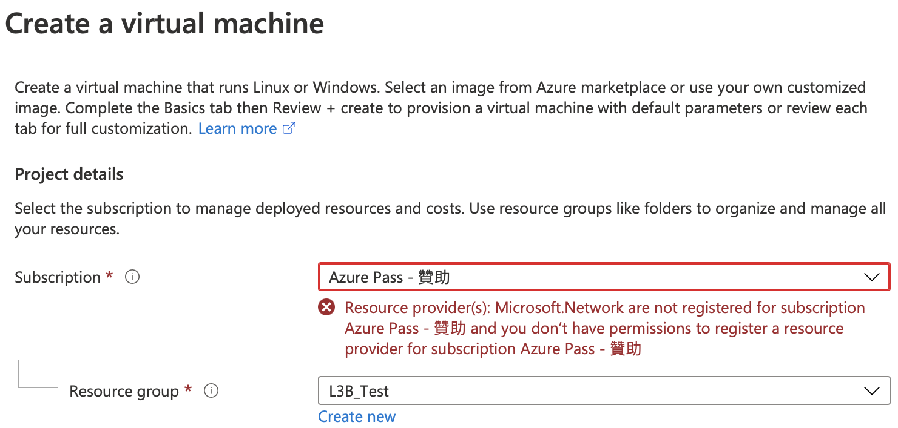
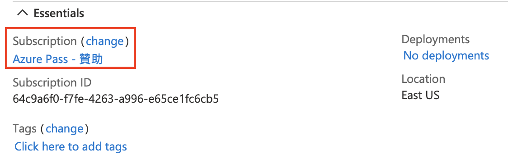
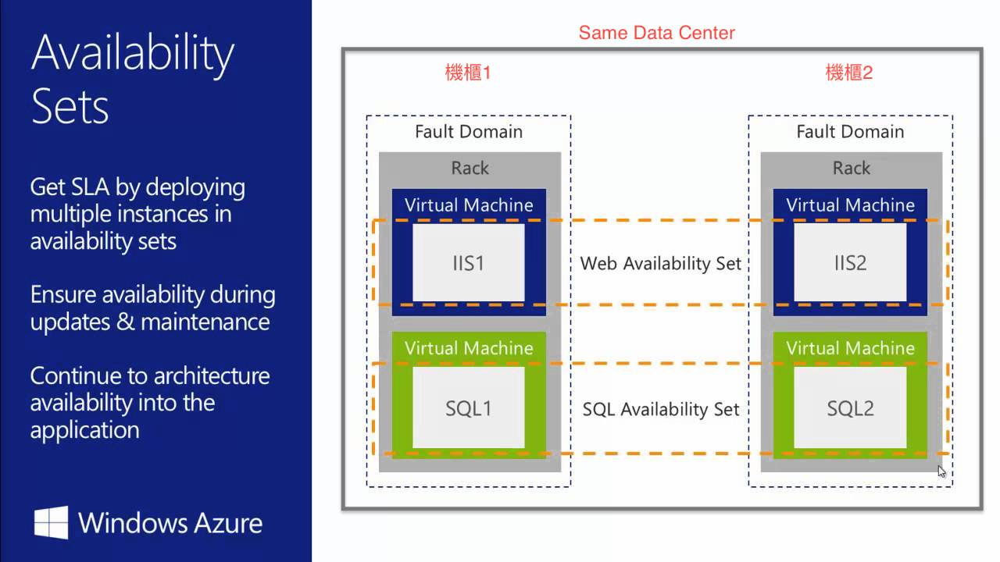

# Azure Learn Lesson
- https://github.com/MicrosoftLearning
    - 104
        - https://microsoftlearning.github.io/AZ-104-MicrosoftAzureAdministrator/
        - https://github.com/MicrosoftLearning/Lab-Demo-Recordings/blob/master/AZ-104.md

## EDA POC
- role (assigned roles)
    - global administrators: 管理 AAD，可以管理 user
- azure policy
    - 不能違反的事項
    - assign policy
        - Not allowed resource types
            1. microsoft.network/virtualnetworks
            3. microsoft.network/virtualnetworks/virtualnetworkpeerings
            2. microsoft.network/networksecuritygroups
        - Allowed locations
            1. southeastasia
        - 注意 policy 連最高的 owner 都會被管理到，所以需要視情況放行(enable -> disable)，完事後再啟動 policy
- access control (IAM): 用這個來控制 end-user 權限，分為 owner, contributor, end-user
    ```json
    "permissions": [
        {
            "actions": [
                "*"
            ],
            "notActions": [
                "Microsoft.Authorization/elevateAccess/action",
                "Microsoft.Authorization/classicAdministrators/write",
                "Microsoft.Authorization/classicAdministrators/delete",
                "Microsoft.Authorization/policyAssignments/write",
                "Microsoft.Authorization/policyAssignments/delete",
                "Microsoft.Authorization/policyAssignments/exempt/action",
                "Microsoft.Authorization/policyAssignments/privateLinkAssociations/write",
                "Microsoft.Authorization/policyAssignments/privateLinkAssociations/delete",
                "Microsoft.Authorization/policyAssignments/resourceManagementPrivateLinks/write",
                "Microsoft.Authorization/policyAssignments/resourceManagementPrivateLinks/delete",
                "Microsoft.Authorization/policyAssignments/resourceManagementPrivateLinks/privateEndpointConnections/write",
                "Microsoft.Authorization/policyAssignments/resourceManagementPrivateLinks/privateEndpointConnections/delete",
                "Microsoft.Authorization/policyAssignments/resourceManagementPrivateLinks/privateEndpointConnectionProxies/write",
                "Microsoft.Authorization/policyAssignments/resourceManagementPrivateLinks/privateEndpointConnectionProxies/delete",
                "Microsoft.Authorization/policyAssignments/resourceManagementPrivateLinks/privateEndpointConnectionProxies/validate/action",
                "Microsoft.Authorization/policyDefinitions/write",
                "Microsoft.Authorization/policyDefinitions/delete",
                "Microsoft.Authorization/policies/audit/action",
                "Microsoft.Authorization/policies/auditIfNotExists/action",
                "Microsoft.Authorization/policies/deny/action",
                "Microsoft.Authorization/policies/deployIfNotExists/action",
                "Microsoft.Authorization/policyExemptions/write",
                "Microsoft.Authorization/policyExemptions/delete",
                "Microsoft.Authorization/policySetDefinitions/write",
                "Microsoft.Authorization/policySetDefinitions/delete",
                "Microsoft.Network/networkSecurityGroups/write",
                "Microsoft.Network/networkSecurityGroups/delete",
                "Microsoft.Network/networkSecurityGroups/securityRules/write",
                "Microsoft.Network/networkSecurityGroups/securityRules/delete",
                "Microsoft.Network/applicationGateways/*",
                "Microsoft.Network/azurefirewalls/*",
                "Microsoft.Network/publicIPAddresses/write",
                "Microsoft.Network/publicIPAddresses/delete",
                "Microsoft.Network/publicIPAddresses/join/action"
            ],
            "dataActions": [],
            "notDataActions": []
        }
    ]
    ```
- 不同 VNet 可以跨 subscription 互相連線: network peering
- service endpoint

## 1. Identity
### Azure Active Directory (建帳號)
AAD is Microsoft’s multi-tenant cloud-based directory and identity management service. For IT Admins, AAD provides an affordable (可負擔的), easy to use solution to give employees and business partners single sign-on (SSO) access to thousands of cloud SaaS Applications like Microsoft 365, Salesforce, DropBox, and Concur.
<br>
<br>

### Azure AD Join
AAD enables SSO to devices, apps, and services from anywhere. The proliferation (增殖) of devices - including Bring Your Own Device (BYOD) – empowers end users to be productive wherever and whenever. But, IT administrators must ensure corporate assets (資產) are protected and that devices meet standards for security and compliance (合規).
<br>

### Bulk User Accounts
- use PowerShell
- import CSV file

## 2. Governance And Compliance (治理與合規)
### Azure Subscriptions
<br>
- subscription usage
    - free
    - pay-as-you-go
    - enterprise agreement
    - student
- cost savings
    - reservations (保留)
        <br>It helps you save money by pre-paying for one-year or three-years of Azure resources.
    - azure hybrid benefits (自帶授權)
        <br>It is a pricing benefit for customers who have licenses with Software Assurance, which helps maximize the value of existing on-premises Windows Server and/or SQL Server license investments when migrating to Azure.
    - azure credits
    - azure regions (區域)
    - budgets (預算)

### Management Groups
If your organization has several subscriptions, you may need a way to efficiently manage access, policies, and compliance for those subscriptions. Azure management groups provide a level of scope above subscriptions. You organize subscriptions into containers called management groups and apply your governance conditions to the management groups.

### Azure Policy
Azure Policy is a service in Azure that you use to create, assign and manage policies. These policies enforce different rules over your resources, so those resources stay compliant with (符合) your corporate standards and service level agreements. Azure Policy does this by running evaluations of your resources and scanning for those not compliant with the policies you have created.
- 連 owner 都會被管道，只要有在 AAD 內都會被管道
- https://github.com/Azure/azure-policy
- NSG, subscription, resource group
- resource types: 僅能建立特定 IaaS, PaaS, SaaS
    <br>
- VM SKUs: 指定規格
- location
- tag
    - 必使用 tag 才能建立資源
        - service type: DB, AP...
    - 繼承 tag
- backup policy

### Role-Based Access Control (RBAC, IAM)
RBAC helps you manage who has access to Azure resources, what they can do with those resources, and what areas they have access to.
- 委派三元素: 範圍、角色、誰
- 產出 json file
    ```powershell
    Get-AzRoleDefinition -name reader | convertto-json
    ```

### Azure RBAC Roles vs Azure AD Roles
| Azure RBAC roles                                                            | Azure AD roles                  |
|-----------------------------------------------------------------------------|---------------------------------|
| Manage access to Azure resources.                                           | Manage access to AAD resources. |
| Scope can be specified at multiple levels (MG, subscription, RG, resource). | Scope is at the tenant level.   |

### RBAC Authentication


## 3. Azure Administration
### Resource Manager
Azure Resource Manager enables you to work with the resources in your solution as a group. You can deploy, update, or delete all the resources for your solution in a single, coordinated operation.

### Group
- dynamic group: 可依據條件來設定群組，例如 job title = XXX
- 在同一個 AAD 下，可跨 subscription 做管理

### Tag
- 管理不同 location、不同 resource group 的資源
    - IaaS: VM
    - PaaS: SQL database
- 同個 resource group，下 tag 沒辦法帶到子目錄去，除非
    - 寫程式
    - azure policy

## Resource
- 同個 AAD 之下， resource 可跨 subscription or other resource group 移動
- 跨 subscription 移動時，要注意目的端有沒有相對應的 resource type register

## Template
https://github.com/Azure/azure-quickstart-templates

## Moving Resources
<br>
https://medium.com/@calloncampbell/moving-your-azure-resources-to-another-subscription-or-resource-group-1644f43d2e07

## 4. Virtual Networking
### Public IP
- basic vs standard
    - basic
        - 動態、靜態 IP
        - 預設無安全政策
    - standard
        - 靜態
        - 預設需有 NSG
        - 支援高可用性

### Network Security Groups (NSG)
NSG contains a list of security rules that allow or deny inbound or outbound network traffic. NSG can be associated to a subnet or a network interface. NSG can be associated multiple times.
- azure firewall 要錢
- 要 same region 才有作用

### Azure Firewall
<br>
- features
    - built-in high availability
    - availability zones
    - unrestricted cloud scalability.
    - application fqdn filtering rules

### Private DNS Zone

### VNet Peering
Perhaps the simplest and quickest way to connect your VNets is to use VNet peering. Virtual network peering enables you to seamlessly (無縫地) connect two Azure virtual networks. Once peered, the virtual networks appear as one, for connectivity purposes.
<br>
<br>
- 軟體定義網路
- 可跨 region, subscription and tenant
    - https://docs.microsoft.com/en-us/azure/virtual-network/create-peering-different-deployment-models-subscriptions
- 資料流出 data center 才要費用

### Gateway Transit and Connectivity
When virtual networks are peered, you can configure a VPN gateway in the peered virtual network as a transit point. In this case, a peered virtual network can use the remote gateway to gain access to other resources. A virtual network can have only one gateway. Gateway transit is supported for both VNet Peering and Global VNet Peering.
<br>

### VPN Gateway
A VPN gateway is a specific type of virtual network gateway that is used to send encrypted traffic between an Azure virtual network and an on-premises location over the public Internet. You can also use a VPN gateway to send encrypted traffic between Azure virtual networks over the Microsoft network. Each virtual network can have only one VPN gateway. However, you can create multiple connections to the same VPN gateway. When you create multiple connections to the same VPN gateway, all VPN tunnels share the available gateway bandwidth.
<br>
- 要建立 route table
- 當要使用 S2S VPN 時，與地端連
- 預設都用 route-based

### ExpressRoute (專線)
Azure ExpressRoute lets you extend your on-premises networks into the Microsoft cloud over a dedicated private connection facilitated by a connectivity provider. With ExpressRoute, you can establish connections to Microsoft cloud services, such as Microsoft Azure, Microsoft 365, and CRM Online.
<br>
<br>

## 6. Network Traffic Management
### Route Table
- 需同 region 才可適用

### Service Endpoint (VNet Service Endpoints)
A VNet service endpoint provides the identity of your virtual network to the Azure service. Once service endpoints are enabled in your virtual network, you can secure Azure service resources to your VNet by adding a VNet rule to the resources.
- 針對 PaaS 服務建立連線，等於微軟幫忙建立 VPN gateway
- 可以對外連線
- 把 VNet 放到 PaaS 內

### Private Link (Private Endpoint，強化安全版 Service Endpoint)
Azure Private Link provides private connectivity from a VNet to Azure PaaS, customer-owned, or Microsoft partner services. It simplifies the network architecture and secures the connection between endpoints in Azure by eliminating (消除) data exposure to the public internet.
- integration with on-premises and peered networks.​
    <br>Access private endpoints over private peering or VPN tunnels from on-premises or peered VNet. Microsoft hosts the traffic, so you don’t need to set up public peering or use the internet to migrate your workloads to the cloud.
- 把 PaaS 放到 VNet 內
- 設定方式，會產生 VNet NIC
    ```mermaid
    graph LR
        A(App Service) -->|Settings| B(Networking)
        B --> C(Private Endpoint connections)
        C --> D(Virtual Network)
    ```
- 不會與外界連線
- https://acloud.guru/forums/az-500-microsoft-azure-security-technologies/discussion/-M5IkN1SzQcDUNRyvaVL/Service%20endpoints%20vs.%20Private%20Endpoints%3F

### Azure Load Balancer (Lev 4)


### Session Persistence
By default, Azure Load Balancer distributes network traffic equally among multiple VM instances. The load balancer uses a 5-tuple (source IP, source port, destination IP, destination port, and protocol type) hash to map traffic to available servers. It provides stickiness only within a transport session.

Session persistence specifies how traffic from a client should be handled. The default behavior (None) is that successive requests from a client may be handled by any virtual machine. You can change this behavior.

### Application Gateway (Lev 7)
Application Gateway manages the requests that client applications can send to a web app. Application Gateway routes traffic to a pool of web servers based on the URL of a request. This is known as application layer routing. The pool of web servers can be Azure virtual machines, Azure virtual machine scale sets, Azure App Service, and even on-premises servers.
<br>
<br>
<br>

## 7. Azure Storage
### Azure Storage Services
- Azure Containers (Blobs): A massively scalable object store for text and binary data.
- Azure Files: Managed file shares for cloud or on-premises deployments.
- Azure Queues: A messaging store for reliable messaging between application components.
- Azure Tables: A NoSQL store for schemaless storage of structured data.

### Securing Storage Endpoints
- firewalls and VNet restricts access to the storage account from specific subnets on VNet or public ip’s.
- subnets and VNet must exist in the same azure region or region pair as the storage account.

### Blob Storage
A service that stores **unstructured data** in the cloud as objects/blobs. Blob storage can store any type of text or binary data, such as a document, media file, or application installer. Blob storage is also referred to as object storage.
<br>
- blob access tiers
    - hot(online)
    - cool(online)
    - archive(offline, 先解凍再讀取)
- 可以建立 rule by lifecycle，去控管檔案的儲存方式
- 可覆寫 container 內容
- files vs blobs

### File Sync

## 8. Azure Virtual Machine
- data disk 可以<font color=#FF0000>熱插拔</font>

### Virtual Machine Storage
- unmanaged disks
- managed disks (推薦)

### Virtual Machine Connections


### Availability Sets
A logical feature used to ensure that a group of related VMs are deployed so that they aren't all subject to a single point of failure and not all upgraded at the same time during a host operating system upgrade in the datacenter. 言下之意是把 VM 放在多個的機櫃上面
- update domain: VM
    - an upgrade domain (UD) is a group of nodes that are upgraded together during the process of a service upgrade (rollout).
- fault domain: 機櫃
    - a fault domain (FD) is a group of nodes that represent a physical unit of failure. A fault domain defines a group of virtual machines that share a common set of hardware, switches, that share a single point of failure.


### Availability Zones (相同 region，不同 data center)
A HA offering that protects your applications and data from datacenter failures.
- each zone is made up of one or more datacenters equipped.
- to ensure resiliency, there’s a minimum of three separate zones in all enabled regions.


### Scaling Concepts
- vertical scaling (scale up and scale down): 須重開機才會生效
- horizontal scaling (scale out and scale in)
- scale sets
    - all VM instances are created from the same base OS image and configuration.
    - 是以 VM 為單位來增加/減少資源
- autoscale
    

### Virtual Machine Extensions
Azure virtual machine extensions are small applications that provide post-deployment configuration and automation tasks on Azure VMs. For example, if a virtual machine requires software installation, anti-virus protection, or a configuration script inside, a VM extension can be used. Extensions are all about managing your virtual machines.

## 9. Serverless Computing (無伺服器運算)
### App Service Overview
- 不能換 region

### Backup an App Service
備份到 storage account 轉為 blob，此時可以換 region

### Container Service
- containers vs virtual machines

## 10. Data Protection
### Azure Backup
Azure Backup is the Azure-based service you can use to back up (or protect) and restore your data in the Microsoft cloud. Azure Backup replaces your existing on-premises or off-site backup solution with a cloud-based solution that is reliable, secure, and cost-competitive.

### Virtual Machine Data Protection
- azure backup
- azure site recovery
    - 用 recover service 備份 azure resource 時，必須為同 region
- managed disk snapshots

## 11. Monitoring

## 高階版
### Azure Databricks SCIM Provisioning Connector
Azure Databricks SCIM Connector allows you to enable Users and Groups synchronization to a Databricks Workspace from Azure AD.
Use Azure AD to manage user access, provision user accounts, and enable SSO with Azure Databricks SCIM Provisioning Connector. Requires an existing Azure Databricks SCIM Provisioning Connector subscription.