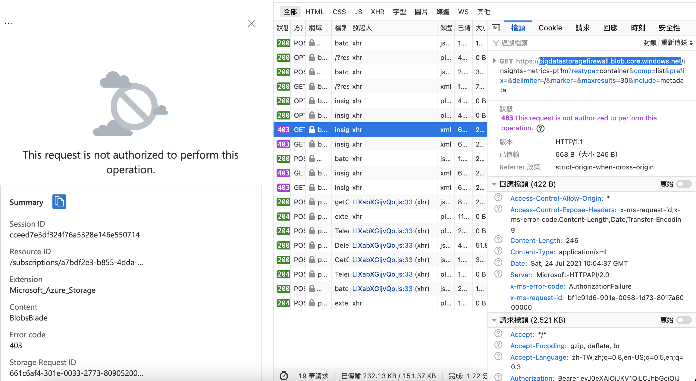

# Reference
https://github.com/Azure/azure-policy/tree/master/built-in-policies/policyDefinitions

# API Management
- API Management services should use a virtual network

# API for FHIR
# App Configuration
# App Platform
# App Service
# Attestation
# Automanage
# Automation
# Azure Active Directory
# Azure Data Explorer
# Azure Government
# Azure Stack Edge
# Backup
# Batch
# Bot Service
# Cache
# Cognitive Services
# Compute
# Container Instance
# Container Registry
# Cosmos DB
# Custom Provider
# Data Box
# Data Factory
# Data Lake
# Event Grid
# Event Hub
# General
# Guest Configuration
# HDInsight
# Internet of Things
# Key Vault
policytestforkeyvault, [必] [EDA] [限內網用] 使用 Private Endpoint：Key Vault
Policy compliance

# Kubernetes service`
# Kubernetes
# Lighthouse
# Logic Apps
# Machine Learning
# Managed Application
# Media Services
# Migrate
# Monitoring
# Network
# Portal
# Regulatory Compliance
# SQL
- [必] [EDA] [限內網用] 禁止公網存取：SQL Database
# Search
# Security Center
# Service Bus
# Service Fabric
# SignalR
# Site Recovery
# Storage
- [ ] Azure File Sync should use private link
- [ ] Storage account public access should be disallowed
    - 若開啟後，從 Portal 無法看 storage container 裡面的資訊
     
- [x] Storage accounts should use private link
- [x] Storage accounts should restrict network access
    - 需用 Selected networks
    - 確認 bigdatastoragefirewall 有沒有符合

# Stream Analytics
# Synapse
# Tags
# VM Image Builder
# Web PubSub