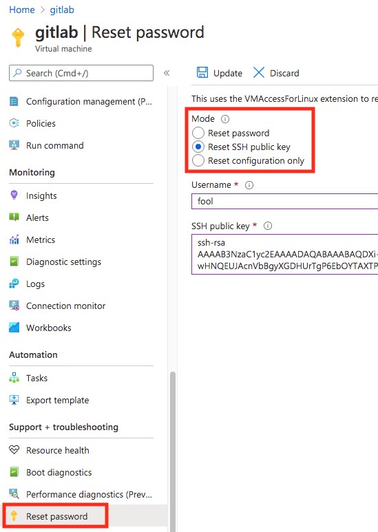

# Azure Command & SOP
- =~ allows case insensitive matching

## Count virtual machines by OS type
```bash
az graph query -q "Resources | where type =~ 'Microsoft.Compute/virtualMachines' | summarize count() by tostring(properties.storageProfile.osDisk.osType)"
```

## 更新 ssh key
- [Reset SSH Keys](https://docs.bitnami.com/azure/faq/troubleshooting/troubleshoot-ssh-keys/)
    - 

## Azure SDK
```bash
# Microsoft.Web/sites
# Microsoft.Compute/virtualMachines
# Microsoft.Network/privateEndpoints
# Microsoft.Network/networkInterfaces
# Microsoft.Network/virtualNetworks
# Microsoft.Storage/storageAccounts
# Microsoft.Compute/disks
# Microsoft.Network/networkSecurityGroups

resource_group="DBA-K8S"
resource_type="Microsoft.Network/networkSecurityGroups"
az resource list \
    --resource-group $resource_group \
    --query "[?type == '$resource_type'].name" | jq .[] -r > temp.txt
cat temp.txt | while read resource_name;
do
    az resource delete \
        -g $resource_group \
        -n $resource_name \
        --resource-type $resource_type \
        --verbose
done
```