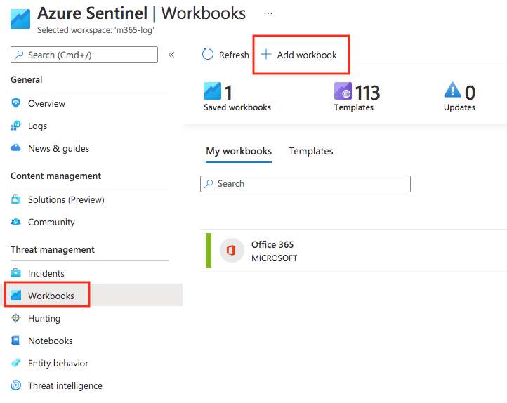
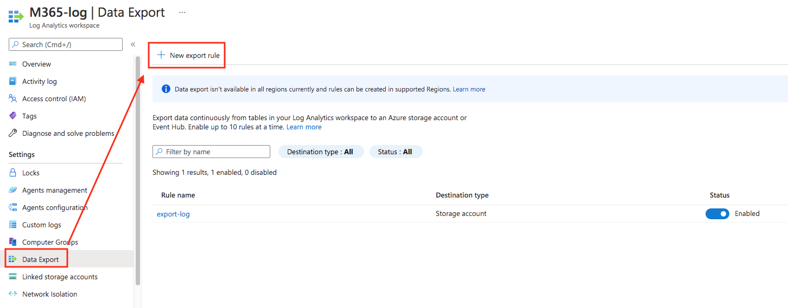

# Sentinel Monitoring
- Deploying any workbooks
    - 

# Log Analytics workspace data export in Azure Monitor
## Enable data export
- Register resource provider
    - Subscriptions
        - Resource providers
            - Microsoft.Insights
                - Registered
- Allow trusted Microsoft services
    - Storage Account
        - Firewalls and virtual networks
            - Allow trusted Microsoft services to access this storage account
- Create or update data export rule
    - 