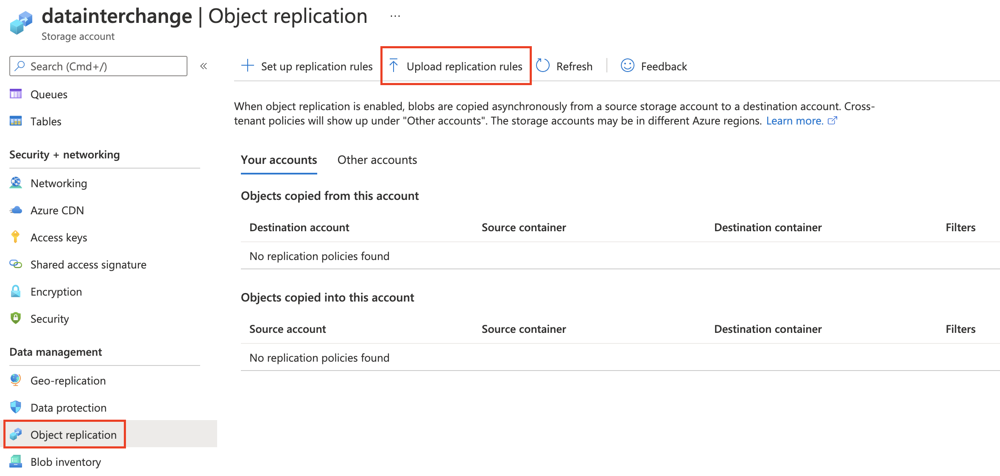
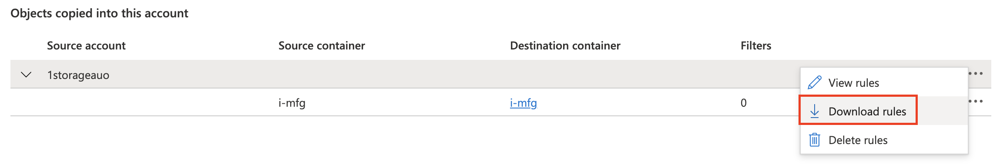

- [Troubleshoot](#troubleshoot)
- [How to mount it?](#how-to-mount-it)
- [Create an NFS share](#create-an-nfs-share)
- [Configure object replication when you have access only to the destination account](#configure-object-replication-when-you-have-access-only-to-the-destination-account)
- [Manage storage account keys with Key Vault and the Azure CLI](#manage-storage-account-keys-with-key-vault-and-the-azure-cli)

# Troubleshoot
- https://docs.microsoft.com/zh-tw/azure/storage/files/storage-troubleshooting-files-nfs

# How to mount it?
<br>
<br>
<br>

# Create an NFS share
```bash
# https://www.wintellect.com/using-nfs-with-azure-blob-storage/
az feature register --namespace Microsoft.Storage --name AllowNFSV3
az feature register --namespace Microsoft.Storage --name PremiumHns
```

# [Configure object replication when you have access only to the destination account](https://docs.microsoft.com/en-us/azure/storage/blobs/object-replication-configure?tabs=portal#configure-object-replication-when-you-have-access-only-to-the-destination-account)
If you do not have permissions to the source storage account, then you can configure object replication on the destination account and provide a JSON file that contains the policy definition to another user to create the same policy on the source account. For example, if the source account is **in a different AAD tenant** from the destination account, then you can use this approach to configure object replication.

Keep in mind that you must be assigned the **ARM Contributor role** scoped to the level of the destination storage account or higher in order to create the policy. For more information, see Azure built-in roles in the Azure role-based access control (Azure RBAC) documentation.

- 建立 policy file: [replication-policy.json](./json/replication-policy.json)
- 到 destination storage
    - 上傳 policy file (此時 ruleId 為空值)
        <br>
    - 下載 policy file (此時 ruleId 已有值)
        <br>
- 到 source storage 上傳該 policy file

# [Manage storage account keys with Key Vault and the Azure CLI](https://docs.microsoft.com/en-us/azure/key-vault/secrets/overview-storage-keys)
```bash
az role assignment create \
    --role "Storage Account Key Operator Service Role" \
    --assignee 'https://vault.azure.net' \
    --scope "/subscriptions/a7bdf2e3-b855-4dda-ac93-047ff722cbbd/resourceGroups/DBA_Test/providers/Microsoft.Storage/storageAccounts/tgfs"

az keyvault set-policy \
    --subscription a7bdf2e3-b855-4dda-ac93-047ff722cbbd \
    --resource-group DBA_Test \
    --name tgfskv \
    --upn tony.lee@auo.com \
    --storage-permissions get list delete set update regeneratekey getsas listsas deletesas setsas recover backup restore purge

az keyvault storage add \
    --vault-name tgfskv \
    -n tgfs \
    --active-key-name key1 \
    --auto-regenerate-key \
    --regeneration-period P90D \
    --resource-id "/subscriptions/a7bdf2e3-b855-4dda-ac93-047ff722cbbd/resourceGroups/DBA_Test/providers/Microsoft.Storage/storageAccounts/tgfs"

# az storage account generate-sas \
#     --expiry 2022-01-01 \
#     --permissions rw \
#     --resource-types sco \
#     --services bfqt \
#     --https-only \
#     --account-name tgfs \
#     --account-key 00000000

az keyvault storage sas-definition create \
    --vault-name tgfskv \
    --account-name tgfs \
    -n tgfssas \
    --validity-period P2D \
    --sas-type account \
    --template-uri <OutputOfSasTokenCreationStep>
```