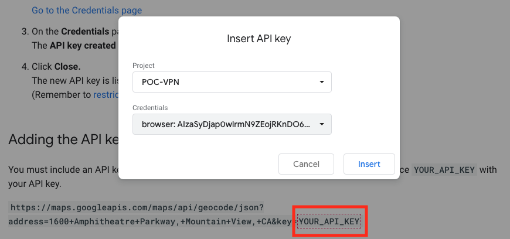
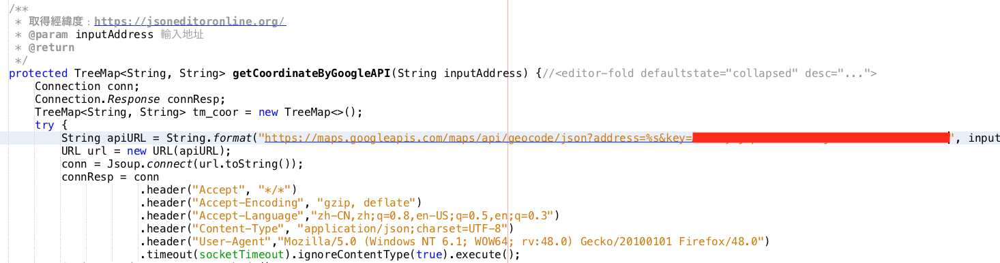

# 地圖 API
## geocod
[使用Google Map API (Geocoding API) 得到點位縣市鄉鎮資料](https://icelandcheng.medium.com/%E4%BD%BF%E7%94%A8google-map-api-geocoding-api-%E5%BE%97%E5%88%B0%E9%BB%9E%E4%BD%8D%E7%B8%A3%E5%B8%82%E9%84%89%E9%8E%AE%E8%B3%87%E6%96%99-25bf5f0e4a21)
- 到這裡找 key: [Adding the API key to your request](https://developers.google.com/maps/documentation/geocoding/get-api-key?authuser=2#add_key)
    - 
- 貼上網址
    - 