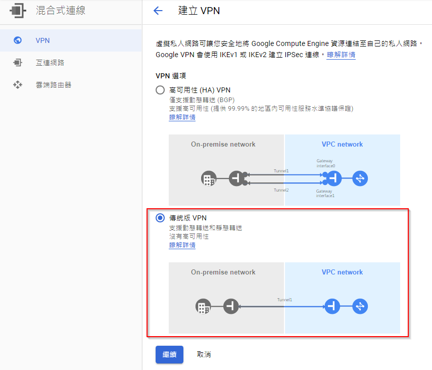
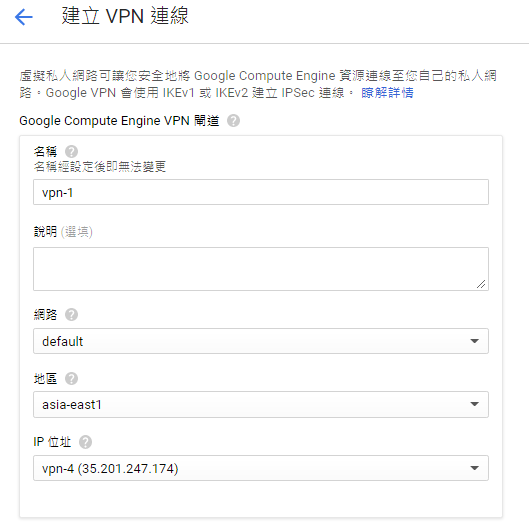
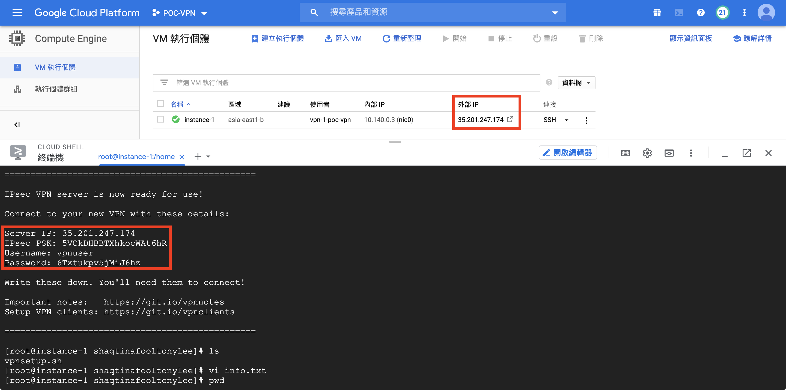
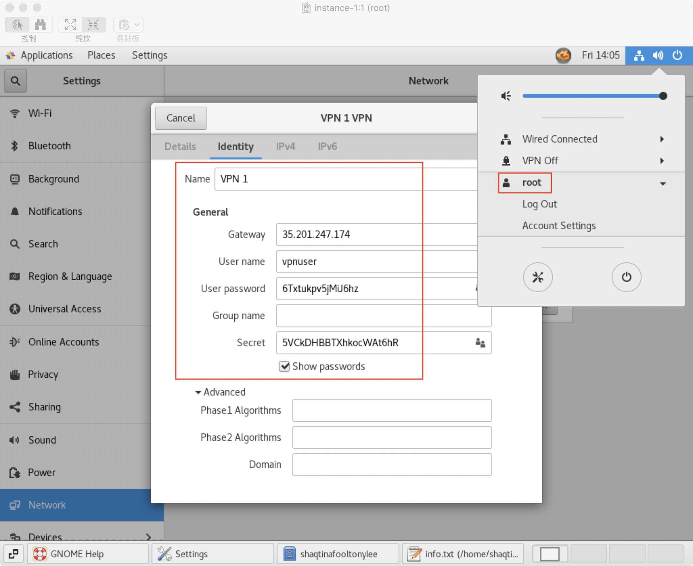

# VPN
## Site to Site VPN connectivity (GCP ⇆ VMware Shared)
### 建立 GCP VPN
- 
- 
- 
- 

### 建立 VMware Shared VPN
- [設定 Edge 閘道的 IPsec VPN 站台連線
](https://docs.vmware.com/tw/VMware-Cloud-Director/9.7/com.vmware.vcloud.tenantportal.doc/GUID-EDFE41C7-C93C-41E7-8437-85163C5278B1.html)
- 
- 

### Confirm


## Point to Site VPN connectivity
### CentOS ⇆ GCP
- [CentOS 架 L2TP/IPsec VPN](http://qbsuranalang.blogspot.com/2016/12/centos-l2tpipsec-vpn.html)
- 安裝 VNC server(需要從 GUI 設定 VPN 資訊)
- `wget https://git.io/vpnsetup-centos -O vpnsetup.sh && sudo sh vpnsetup.sh`
    - 
- 啟動 IPSec Service
    ```bash
    systemctl start ipsec.service
    systemctl enable ipsec.service
    ```
- 進入 GUI 設定 VPN
    - 