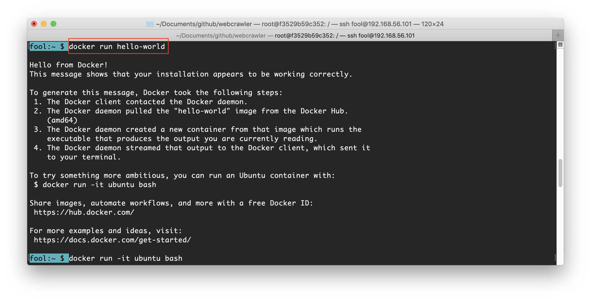
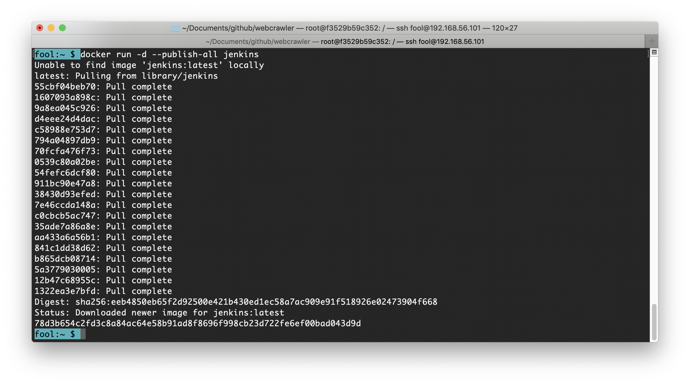
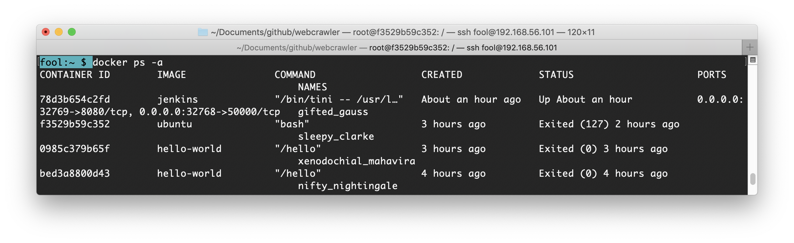
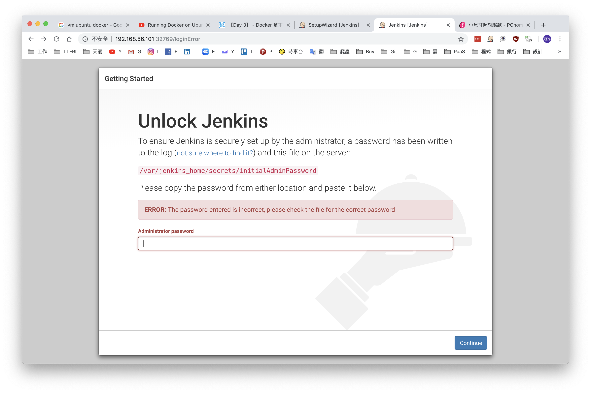
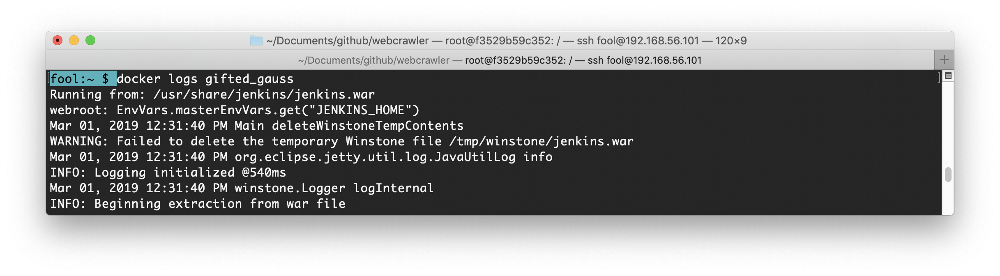
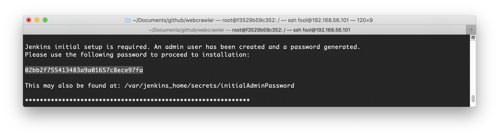
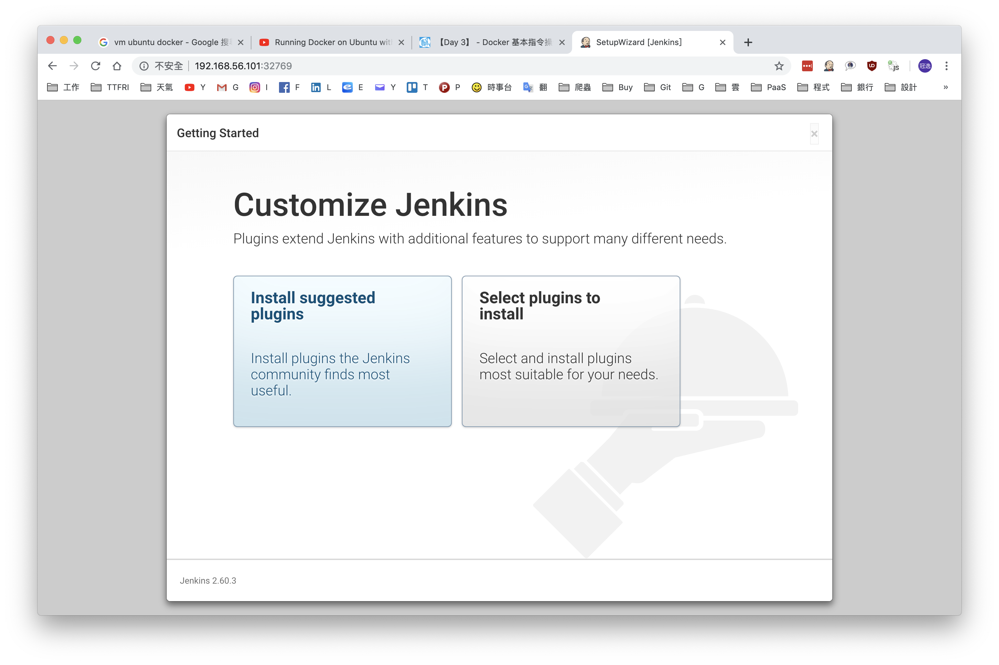

# Docker
## 秒懂架構

- 重點
    ```txt
    docker 映象檔是一種分層堆疊的運作方式，採用了 aufs 的檔案架構。要建立一個可提供應用程式完整執行環境的 container 映象檔，要先從一個基礎映象檔(base image)開始疊起，一層層將不同 stack 的 docker 映象檔疊加上去，最後組合成一個應用程式所需 container 執行環境的映象檔，而每一個 stack 也都是可以會匯出成(docker commit指令)一個映象檔。
    ```
- 舉例(undone)
    1. `docker pull ubuntu`
    2. `docker pull httpd`
    3. `docker pull mysql:latest`
    4. `sudo docker run`

## About
傳統虛擬化技術如 vSphere 或 Hyper-V 是以作業系統為中心，而 container 技術則是一種以應用程式為中心的虛擬化技術。

## 安裝 Docker
- Ubuntu
    - 安裝 curl：`sudo apt install curl`
    - 安裝 docker：`curl -sSL https://get.docker.com/ubuntu/ | sudo sh`
- CentOS
    - `yum install yum-utils device-mapper-persistent-data lvm2 -y`
    - `yum-config-manager --add-repo https://download.docker.com/linux/centos/docker-ce.repo`
    - `yum install docker-ce -y`
    - `systemctl start docker && systemctl enable docker`
    - `sudo usermod -aG docker USERNAME`
- macOS
早期的 Windows Docker 是使用 VirtualBox 的虛擬機實現的，但是新版的 Docker for Windows 直接使用 Hyper-V
    - 版本需大於 10.14

## 指令
- 啟動 docker：`docker start`
- 關閉 docker：`docker stop`

## 操作步驟
1. `sudo docker run hello-world`
    - 
2. `docker run -d --publish-all jenkins`
    - 
3. `docker ps -a`
    - 
4. 輸入網址：localhost:32769
    - 
5. `docker logs gifted_gauss`
    - 
    - 
    - 