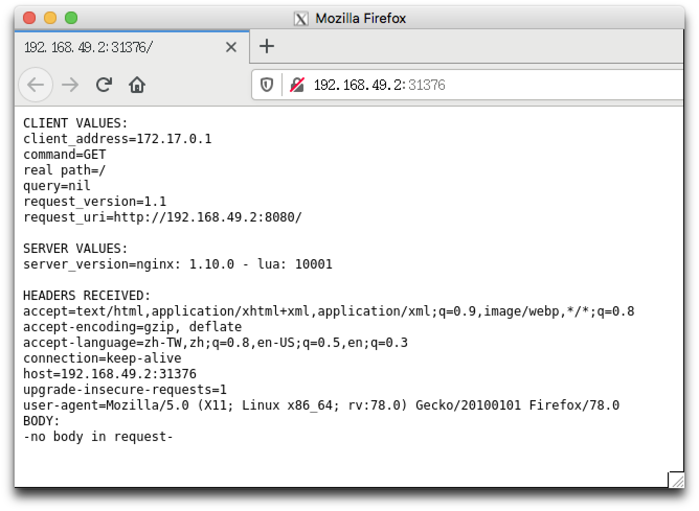

# Kubernetes
<br>
Kubernetes is a portable, extensible, open-source platform for managing containerized workloads and services, that facilitates both declarative configuration and automation. It has a large, rapidly growing ecosystem. Kubernetes services, support, and tools are widely available.
## Reference
- [Installing Docker on CentOS 7 With Yum](https://phoenixnap.com/kb/how-to-install-docker-centos-7)
- [Steps for Installing Kubernetes on CentOS 7](https://phoenixnap.com/kb/how-to-install-kubernetes-on-centos)
- https://blog.tomy168.com/2019/08/centos-76-kubernetes.html
- https://blog.johnwu.cc/article/kubernetes-exercise.html
- https://ithelp.ithome.com.tw/articles/10235069?sc=iThomeR

## Information
一個可以幫助我們管理微服務(microservices)的系統，他可以自動化地部署及管理多台機器上的多個容器(container)。Kubernetes 想解決的問題是：「手動部署多個容器到多台機器上並監測管理這些容器的狀態非常麻煩。」而 Kubernetes 要提供的解法： 提供一個平台以較高層次的抽象化去自動化操作與管理容器們。
    - 
    - 

## Know docker
差異就在: https://nakivo.medium.com/kubernetes-vs-docker-what-is-the-difference-3b0c6cce97d3
- 網路
- use cases
- cluster

## Minikube
- [Hello Minikube](https://kubernetes.io/docs/tutorials/hello-minikube/)
- Minikube 是由 Google 發布的一個輕量級工具
- 可在本機上輕易架設一個 Kubernetes Cluster
- Minikube 會在本機上跑起一個 virtual machine，並且在這 VM 裡建立一個 signle-node Kubernetes Cluster
- 本身並不支援 HA (High availability)，也不推薦在實際應用上運行
- 範例
    - https://minikube.sigs.k8s.io/docs/start/
- demo
    - 
    - `kubectl get pods --all-namespaces`

## Master
### 1. Installing kubeadm on your hosts
- `kubeadm init --pod-network-cidr=10.244.0.0/16`
    - 使用 Flannel CNI
- 用 non-root user 執行
    ```bash
    mkdir -p $HOME/.kube
    sudo cp -i /etc/kubernetes/admin.conf $HOME/.kube/config
    sudo chown $(id -u):$(id -g) $HOME/.kube/config
    ```

### 2. Installing a Pod network add-on
- `kubectl apply -f https://raw.githubusercontent.com/coreos/flannel/v0.10.0/Documentation/kube-flannel.yml`
    ```txt
    Warning: rbac.authorization.k8s.io/v1beta1 ClusterRole is deprecated in v1.17+, unavailable in v1.22+; use rbac.authorization.k8s.io/v1 ClusterRole
    clusterrole.rbac.authorization.k8s.io/flannel created
    Warning: rbac.authorization.k8s.io/v1beta1 ClusterRoleBinding is deprecated in v1.17+, unavailable in v1.22+; use rbac.authorization.k8s.io/v1 ClusterRoleBinding
    clusterrolebinding.rbac.authorization.k8s.io/flannel created
    serviceaccount/flannel created
    configmap/kube-flannel-cfg created
    error: unable to recognize "https://raw.githubusercontent.com/coreos/flannel/v0.10.0/Documentation/kube-flannel.yml": no matches for kind "DaemonSet" in version "extensions/v1beta1"
    ```
    - 出現錯誤: The connection to the server localhost:8080 was refused - did you specify the right host or port?
        - [權限不足](https://developer.aliyun.com/article/652961): `echo "export KUBECONFIG=/etc/kubernetes/admin.conf" >> ~/.bash_profile && . ~/.bash_profile`
- `kubectl get pods --all-namespaces`
    ```txt
    NAMESPACE     NAME                                 READY   STATUS    RESTARTS   AGE
    kube-system   coredns-f9fd979d6-sdb6d              0/1     Pending   0          3h12m
    kube-system   coredns-f9fd979d6-vzwpg              0/1     Pending   0          3h12m
    kube-system   etcd-k8s-master                      1/1     Running   0          3h12m
    kube-system   kube-apiserver-k8s-master            1/1     Running   0          3h12m
    kube-system   kube-controller-manager-k8s-master   1/1     Running   0          3h12m
    kube-system   kube-proxy-nqgbz                     1/1     Running   0          3h12m
    kube-system   kube-scheduler-k8s-master            1/1     Running   0          3h12m
    ```

## Node
<br>
- 加入 cluster
    ```bash
    kubeadm join 10.140.0.4:6443 --token 1das02.s6wivqluldzn4jn6 \
    --discovery-token-ca-cert-hash sha256:5d3cc5d02eee6446b10547ea2ad12ab364c249a9fdc7884d3309fccb6d03c42f
    ```
    - 失敗的話: https://stackoverflow.com/questions/55531834/kubeadm-fails-to-initialize-when-kubeadm-init-is-called
        - `echo 1 > /proc/sys/net/ipv4/ip_forward`