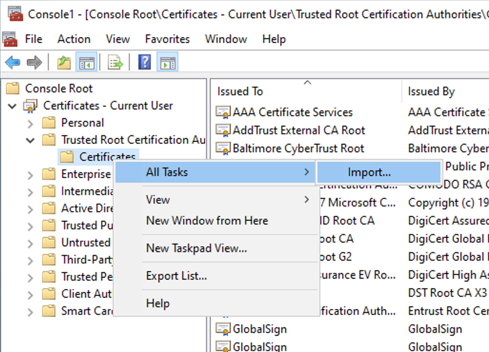
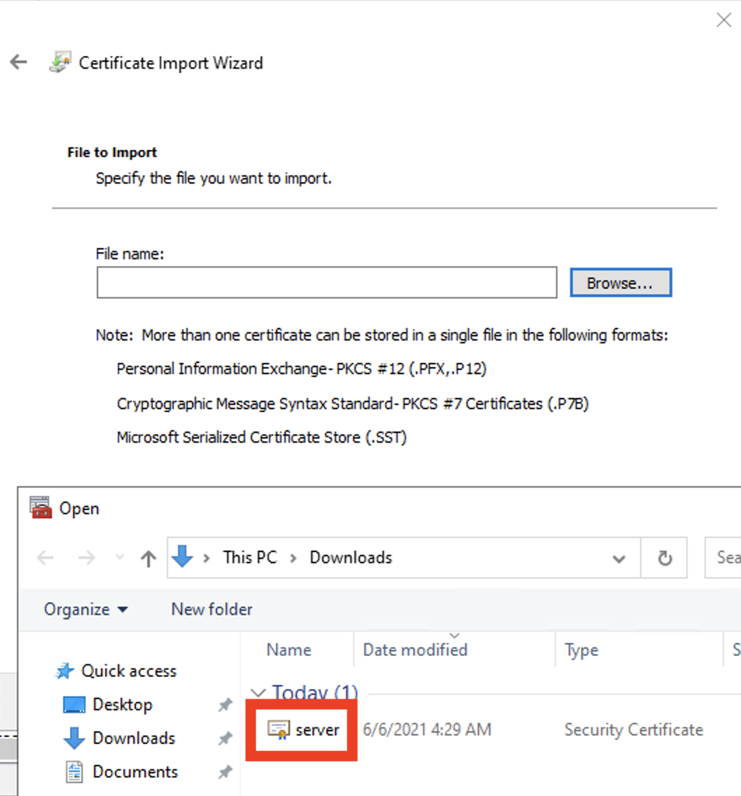
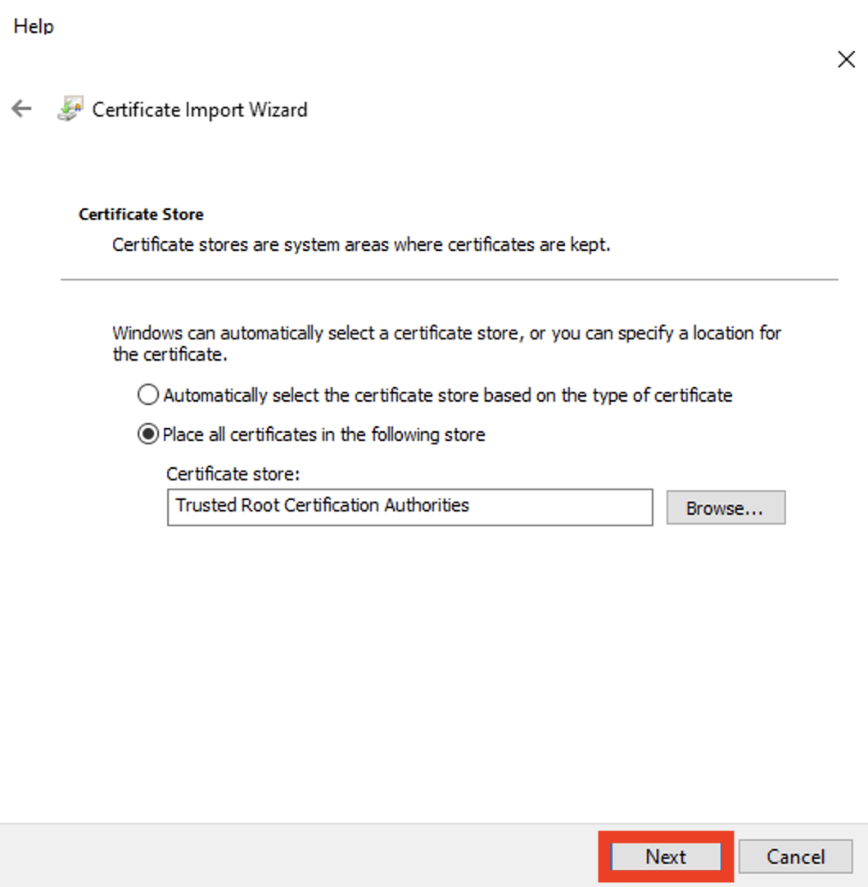
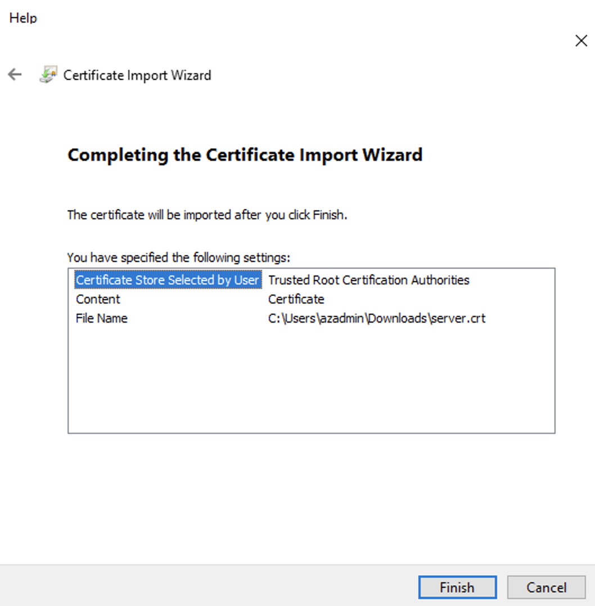
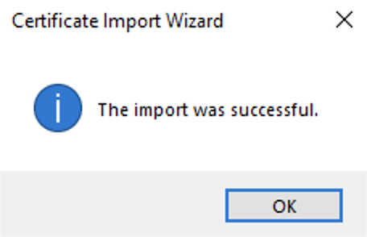

# Maintain List
## 重點概念
- OpenShift cluster 不需備份 VM，因為已經是 cluster 架構了，壞了在透過 yaml rebuild 就好
    - 嚴格說起來，一台 Master VM 也可以執行 WKC
- 需要備份的是 Bastion VM，因為上面有 ssh key、kubeadm 密碼
- etcd 備份到 storage account

## Azure
- WKC 資源若被 delete，會 auto-rebuild
- Recovery Services Vault (保存庫)
    - Geo-redundant storage (GRS, 異地備援儲存體)
        <br>
    - 定期備份 Bastion、NFS VM
        - 一天一次，保留最近三天
        - WKC cluster 缺少 VM agent，無法備份
- SLA for Virtual Machines
    <br>For any Single VM using Premium SSD or Ultra Disk for all OS Disks and Data Disks, we guarantee you will have VM Connectivity of at least 99.9%. (一年最多停機 8.76 小時)
- NFS
    ```bash
    subscription_id="de61f224-9a69-4ede-8273-5bcef854dc20"
    az feature register --namespace Microsoft.Storage --name AllowNFSV3 --subscription $subscription_id

    # check
    subscription_id="de61f224-9a69-4ede-8273-5bcef854dc20"
    az feature show --namespace Microsoft.Storage --name AllowNFSV3 --subscription $subscription_id
    ```

## OpenShift
### Creating a Self-Signed SSL Certificate for your Intranet Services
可參考保哥文章: [如何使用 OpenSSL 建立開發測試用途的自簽憑證 (Self-Signed Certificate)](https://blog.miniasp.com/post/2019/02/25/Creating-Self-signed-Certificate-using-OpenSSL)

#### Replacing the default ingress certificate
- 建立 ssl.conf 設定檔: `vi ssl.conf`
    ```
    [req]
    prompt = no
    default_md = sha256
    default_bits = 2048
    distinguished_name = dn
    x509_extensions = v3_req

    [dn]
    C = TW
    ST = Taiwan
    L = Taipei
    O = Test Inc.
    OU = IT Department
    emailAddress = admin@example.com
    CN = localhost

    [v3_req]
    subjectAltName = @alt_names

    [alt_names]
    DNS.1 = *.apps.dba-k8s.test.org
    DNS.2 = api.dba-k8s.test.org
    ```
- 產生自簽憑證與相對應的私密金鑰
    >openssl req -x509 -new -nodes -sha256 -utf8 -days 3650 -newkey rsa:2048 -keyout server.key -out server.crt -config ssl.conf
    - 請注意：上述命令會建立一個「未加密」的私密金鑰檔案，使用 PEM 格式輸出。
- 透過 OpenSSL 命令產生 PKCS#12 憑證檔案 (使用時，需密碼)
    >openssl pkcs12 -export -in server.crt -inkey server.key -out server.pfx
- 在 bastion 設定憑證
    ```bash
    oc create configmap custom-ca \
        --from-file=ca-bundle.crt=/home/azadmin/server.crt \
        -n openshift-config

    oc patch proxy/cluster \
        --type=merge \
        --patch='{"spec":{"trustedCA":{"name":"custom-ca"}}}'

    oc create secret tls my-tls-migration \
        --cert=/home/azadmin/server.crt \
        --key=/home/azadmin/server.key \
        -n openshift-ingress

    oc patch ingresscontroller.operator default \
        --type=merge -p \
        '{"spec":{"defaultCertificate": {"name": "my-tls-migration"}}}' \
        -n openshift-ingress-operator
    ```
- 匯入自簽憑證到「受信任的根憑證授權單位」
    <br>
    <br>
    <br>
    <br>
    <br>

### 調整 worker 數量
1. View the machine sets that are in the cluster
    `oc get machinesets -n openshift-machine-api`
2. Scale the machine set
    `oc scale --replicas=2 machineset <machineset> -n openshift-machine-api`
    or
    `oc edit machineset <machineset> -n openshift-machine-api`

### 沒開機不能 Login
```bash
oc login https://api.dba-k8s.test.org:6443 -u kubeadmin -p `cat ~/ocp4.5_cust/auth/kubeadmin-password`
```
error: dial tcp 10.0.10.5:6443: connect: no route to host - verify you have provided the correct host and port and that the server is currently running.


```bash
ssh core@$node sudo shutdown -h now
nodes=$(oc get nodes -ojsonpath='{​​​​​​​​.items[*].metadata.name}​​​​​​​​')

# 重啟 Worker 步驟
https://docs.openshift.com/container-platform/4.5/nodes/nodes/nodes-nodes-working.html
oc adm cordon <worker-node>
oc adm drain <worker-node> --ignore-daemonsets --force=true --delete-local-data=true

ssh core@NODE_NAME
sudo -i
systemctl stop kubelet
systemctl stop crio
systemctl reboot

oc adm uncordon <worker-node>
```

## 備份
### OpenShift
- https://docs.openshift.com/container-platform/4.5/backup_and_restore/backing-up-etcd.html

#### Backing up etcd
- etcd is the key-value store for OCP, which persists the state of all resource objects.
1. Start a debug session for a master node
    >oc debug node/<node_name>
2. Change your root directory to the host
    >chroot /host
3. If the cluster-wide proxy is enabled, be sure that you have exported the NO_PROXY, HTTP_PROXY, and HTTPS_PROXY environment variables
4. Run the cluster-backup.sh script and pass in the location to save the backup to
    >/usr/local/bin/cluster-backup.sh /home/core/assets/backup

### WKC (CP4D)

## 維運
### 大型維運
#### Shutting down the cluster
#### Restarting the cluster gracefully
#### Disaster Recovery

### 日常維運
#### Replacing an unhealthy etcd member
- Check the status of the EtcdMembersAvailable status condition using the following command
    >oc get etcd -o=jsonpath='{range .items[0].status.conditions[?(@.type=="EtcdMembersAvailable")]}{.message}{"\n"}'
- Review the output
    - 好: 3 members are available
    - 壞: 2 of 3 members are available, ip-10-0-131-183.ec2.internal is unhealthy

#### (Replacing the unhealthy etcd member)[https://docs.openshift.com/container-platform/4.5/backup_and_restore/replacing-unhealthy-etcd-member.html#replacing-the-unhealthy-etcd-member] (未完成...)
-  Replacing an unhealthy etcd member whose machine is not running or whose node is not ready
    1. Remove the unhealthy member.