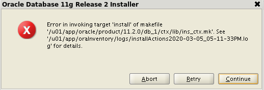
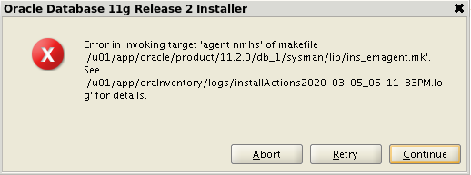

# 安裝 Oracle SOP
## 建立帳號、群組
```bash
groupadd -g 501 dba
groupadd -g 502 oinstall
useradd -G 501,502 -u 501 -m demo
```

## 設定環境變數
```bash
# User specific environment and startup programs
export ORACLE_SID=DEMO
export ORACLE_BASE=/u01/oracle
export ORACLE_HOME=$ORACLE_BASE/11204
export TNS_ADMIN=$ORACLE_HOME/network/admin
LD_LIBRARY_PATH=$ORACLE_HOME/lib:/lib:/usr/lib
export LD_LIBRARY_PATH
CLASSPATH=$ORACLE_HOME/JRE:$ORACLE_HOME/jlib:$ORACLE_HOME/rdbms/jlib
export CLASSPATH
PATH=$PATH:$HOME/bin:$ORACLE_HOME/bin
export PATH

# Alias
alias sqlp='sqlplus / as sysdba'
alias rm='rm -i'
alias vi='vim'
alias grep='grep --color=always'
alias tree='tree --charset ASCII'
#alias bdump="cd /u01/oracle/diag/rdbms/demo/DEMO/trace"
#alias bdump="cd /u01/oracle/diag/rdbms/demo_stb/DEMO/trace"
```

## 檢查 LVM setting(option)

## 安裝 VNC server(option)
```bash
# 安裝
yum install tigervnc-server -y

# 複製 service config
cp /lib/systemd/system/vncserver@.service /etc/systemd/system/vncserver@:1.service

# 修改 service config
sed -i 's/<USER>/demo/g' /etc/systemd/system/vncserver@:1.service

# 確認 root 的路徑是否正確(option)
vi vncserver@:1.service
PIDFile=/root/.vnc/%H%i.pid

# 登入各個帳號去設定以下(systemctl daemon-reload??)
systemctl status vncserver@:1.service
systemctl enable vncserver@:1.service

# 設定密碼
vncserver(啟動 vnc server，需依照各別 user account)
vncpasswd

# 重啟
reboot

# 開機啟動
crontab -e
@reboot /bin/vncserver :1

# 檢查
netstat -tln
tcp 0 0 0.0.0.0:5901 0.0.0.0:* LISTEN
```

## Pretreatment(option)
- 安裝懶人包
    1. `yum install epel-release -y`
    2. `wget http://public-yum.oracle.com/public-yum-ol7.repo -O /etc/yum.repos.d/public-yum-ol7.repo`
    3. `wget http://public-yum.oracle.com/RPM-GPG-KEY-oracle-ol7 -O /etc/pki/rpm-gpg/RPM-GPG-KEY-oracle`
    4. `yum install oracle-rdbms-server-11gR2-preinstall -y`
- checking hardware requirements
    - memory requirements
        - `grep MemTotal /proc/meminfo`
        - `grep SwapTotal /proc/meminfo`
    - automatic memory management
        - `df -h /dev/shm/`
        - 永久有效(7G 的置換空間)
            - `shmfs /dev/shm tmpfs size=7g 0`

## 安裝 oracle database
- `./database/runInstaller`(用 oracle 帳號，不能用 root)
- [x] install database software only
- [x] single instance database installation
- [x] enterprise edition(企業版才有 data guard)
- prerequisite checks
    - `yum install gcc* libaio-devel* glibc-* libXi* libXtst* unixODBC* compat-libstdc* libstdc* binutils* compat-libcap1* -y`
    - `vi /etc/sysctl.conf`(有用懶人包會自動生成)
        ```txt
        fs.file-max = 6815744
        kernel.shmall = 2097152
        kernel.shmmax = 536870912
        kernel.shmmni = 4096
        kernel.sem = 250 32000 100 128
        net.ipv4.ip_local_port_range = 9000 65500
        net.core.rmem_default = 262144
        net.core.rmem_max = 4194304
        net.core.wmem_default = 262144
        net.core.wmem_max = 1048576
        ```
    - 執行 `/tmp/CVU_11.2.0.1.0_oracle/runfixup.sh`
        - install error
            - 
            - 
        - `vi $ORACLE_HOME/ctx/lib/ins_ctx.mk`
            ```bash
            # 原本
            ctxhx: $(CTXHXOBJ)
                $(LINK_CTXHX)  $(CTXHXOBJ)  $(INSO_LINK)

            # 改成(也要 tab)
            ctxhx: $(CTXHXOBJ)
                -static $(LINK_CTXHX) $(CTXHXOBJ) $(INSO_LINK) /usr/lib/gcc/x86_64-redhat-linux/4.8.2/libstdc++.so

            # tip
            sed -i 's/$(LINK_CTXHX) $(CTXHXOBJ) $(INSO_LINK)/-static $(LINK_CTXHX) $(CTXHXOBJ) $(INSO_LINK) \/usr\/lib\/gcc\/x86_64-redhat-linux\/4.8.2\/libstdc++.so/g' $ORACLE_HOME/ctx/lib/ins_ctx.mk
            ```
        - `vi $ORACLE_HOME/sysman/lib/ins_emagent.mk`
            ```bash
            # 原本
            $(SYSMANBIN)emdctl:
                $(MK_EMAGENT_NMECTL)

            # 改成
            $(SYSMANBIN)emdctl:
                $(MK_EMAGENT_NMECTL) -lnnz11

            # tip
            sed -i 's/$(MK_EMAGENT_NMECTL)/$(MK_EMAGENT_NMECTL) -lnnz11/g' $ORACLE_HOME/sysman/lib/ins_emagent.mk
            ```
    - 執行
        ```bash
        /u01/oraInventory/orainstRoot.sh
        $ORACLE_HOME/root.sh
        ```

## 安裝 listener
- 執行 `$ORACLE_HOME/bin/netca`
- 一直下一步
    - [不容易發現的問題](https://www.itread01.com/content/1549111156.html)
- `vi $ORACLE_HOME/network/admin/listener.ora`(如果沒有就新增)
    ```txt
    LISTENER =
        (DESCRIPTION_LIST =
            (DESCRIPTION =
                (ADDRESS = (PROTOCOL = TCP)(HOST = primary)(PORT = 1521))
            )
        )

    SID_LIST_LISTENER =
        (SID_LIST =
            (SID_DESC =
                (SID_NAME = DEMO)
                (ORACLE_HOME = /u01/oracle/11204)
            )
        )

    # Automatic Diagnostic Repository
    ADR_BASE_LISTENER = /u01/oracle
    ```
- http://shinchuan1.blogspot.com/2014/04/oracle-listener.html
- https://k21academy.com/oracle-apps-dba-r12/solved-ebs-r12-2-tns-12560-tnsprotocol-adapter-error-tns-00584-valid-node-checking-configuration-error/

## 執行 dbca
- Reference
    - [How to Use the Database Configuration Assistant (DBCA) to Create Databases in Oracle 12c](https://www.dummies.com/programming/databases/how-to-use-the-database-configuration-assistant-dbca-to-create-databases-in-oracle-12c/)
- 執行 `$ORACLE_HOME/bin/dbca`
    - operations
        - [x] create a database
    - database templates
        - [x] customer database
    - database identification
        - global database name / SID 要和環境變數一樣
    - managerment options
        - enterprise managerment 不設定
    - database file locations
        - storage type: file system
        - storage location: use common location for all database files
    - recovery configuration
        - 不用 specify flash recovery area
        - 檔名: DEMO-%t_%s_%r.dbf
        - 路徑: `/u01/oraarch/DEMO`
    - database content
        - 僅選 enterprise managerment repository
    - initialization parameters
        - sizing(option)
            - processes: 150 -> 1500
        - character sets
            - use unicode
    - 一直下一步
    - finish

## 檢查 cron jobs(option)
開機啟動 listener
- `crontab -e`
    - `@reboot /home/demo/start-db.sh`
- `vi start-db.sh`
    ```bash
    export ORACLE_SID=DEMO
    export ORACLE_HOME=/u01/oracle/11204
    export TNS_ADMIN=$ORACLE_HOME/network/admin

    NOW=`date +%Y-%m-%d-%H%M`
    $ORACLE_HOME/bin/lsnrctl start > $HOME/log/lsnrctl-$NOW.log
    $ORACLE_HOME/bin/sqlplus / as sysdba > $HOME/log/startup-$NOW.log << EOF
    startup;
    quit;
    EOF
    ```

## 建立 account
```sql
CREATE USER DEMO IDENTIFIED BY demo DEFAULT tablespace ts_demo;
GRANT CONNECT TO demo_admin;
GRANT CREATE SESSION TO demo_admin; -- 必要
GRANT ALL ON DEMO.TEAM TO demo_admin;
GRANT demo_admin TO demo;
```

## 增加 swap(option)
- `dd if=/dev/zero of=/swapfile count=4096 bs=1MiB`
- `chmod 600 /swapfile`
- `mkswap /swapfile`
- `swapon /swapfile`
- `swapon -s`
- `free -m`
- `vi /etc/fstab`
    ```txt
	/swapfile swap  swap  sw  0 0
    ```