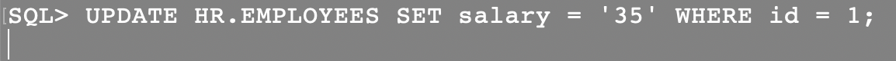
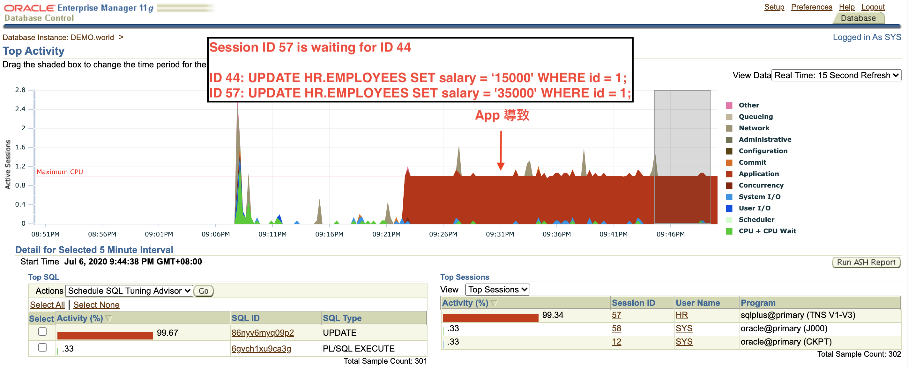
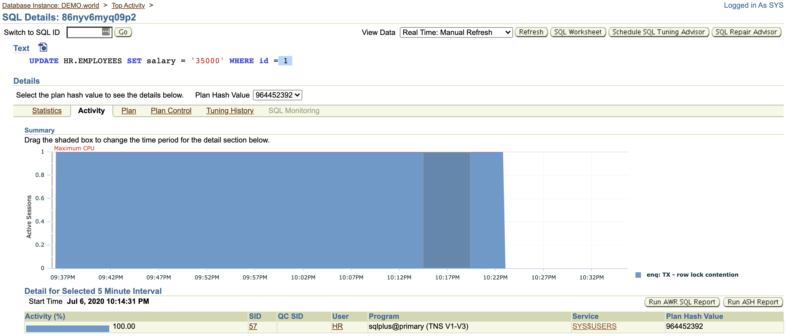
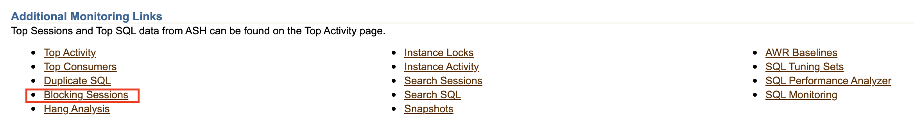
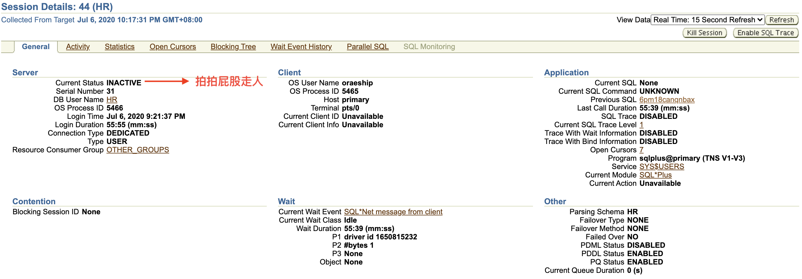
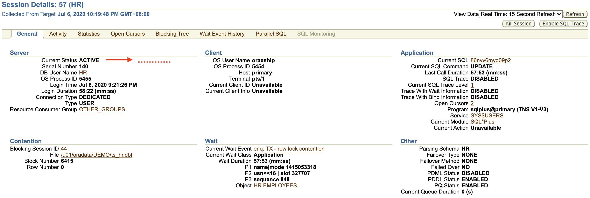

# Troubleshooting
## Block sessions
1. user 的 sql GG，執行後 hand 住
    
2. 進 OEM 看 top activity，看到紅紅的就不對勁，發現是這個 sql(86nyv6myq09p2)
    
3. 進去找原因，看到 update 指令，馬上聯想到 block session
    
4. 進 block session 看看
    
5. 找到作案手法了
    
6. 身家調查 session 看看
    - 兇手
        
    - 被害者
        
7. 只好 kill block session