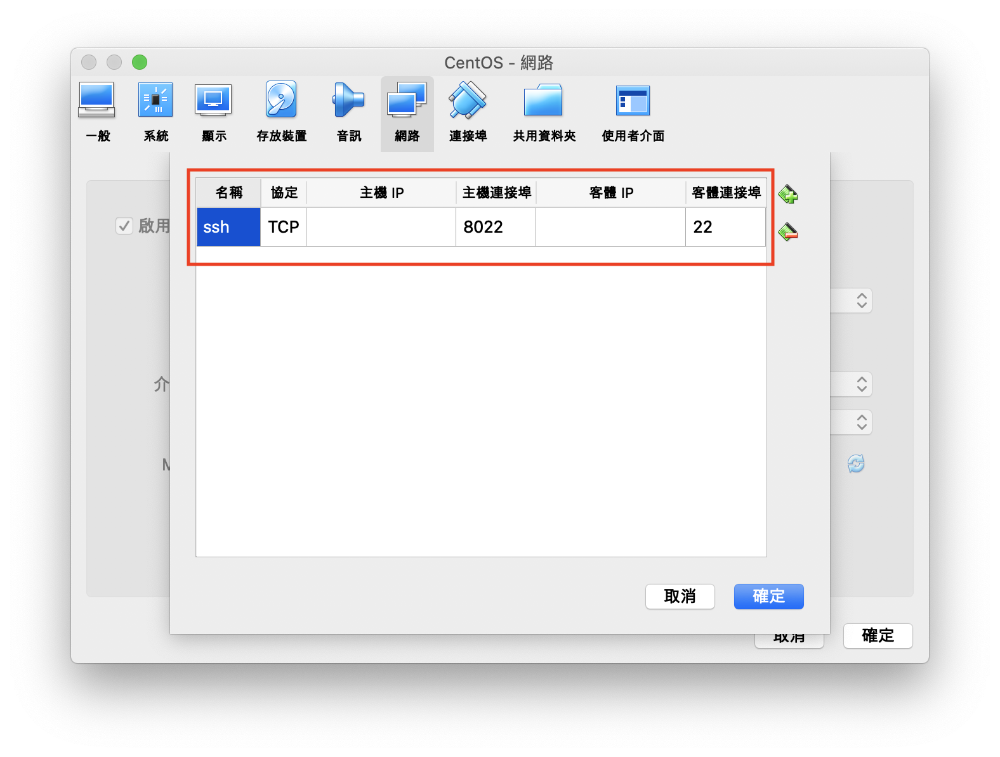
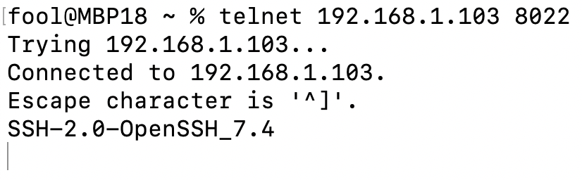

# Operation method of Virtualbox on MacOS
## 安裝檔
https://download.virtualbox.org/virtualbox/5.2.18/VirtualBox-5.2.18-124319-OSX.dmg

## Guest Additions
直接在選單執行，會掛載在光碟槽

## Extension Pack
- https://download.virtualbox.org/virtualbox/5.2.18/Oracle_VM_VirtualBox_Extension_Pack-5.2.18.vbox-extpack
- 喜好設定 > 擴充功能

## 改 Mac Addres
設定 > 網路 > 進階 > MAC 位址，輸入 MAC Address

## 主客機連線
1. 在 Virtual Box 虛擬機新增網卡
    
    
2. 到 Guest OS 開啟網路，並確認是否有新增網路
3. OK

# 增加硬碟空間
- [〔Linux筆記〕VirtualBox擴充磁碟空間](https://vocus.cc/@xerion30476/5cb5ab62fd897800016e3fee)

# 網路設定
- [Oracle VM VirtualBox 網路設定與網卡說明](https://kanchengzxdfgcv.blogspot.com/2015/10/oracle-vm-virtualbox.html)
- [網路講解](https://www.nakivo.com/blog/virtualbox-network-setting-guide/)
- [Port Forwarding](https://nsrc.org/workshops/2014/btnog/raw-attachment/wiki/Track2Agenda/ex-virtualbox-portforward-ssh.htm#fn1)
    - 主客機 port 不能一樣
        
        
        