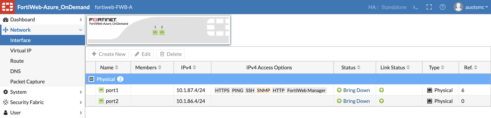
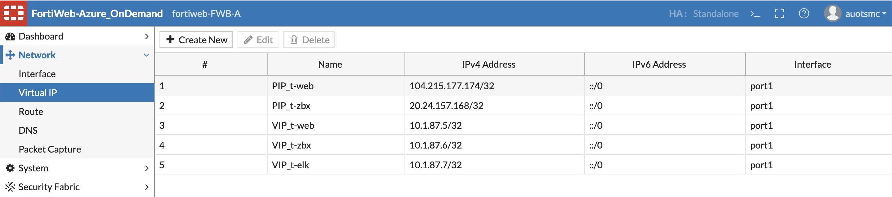
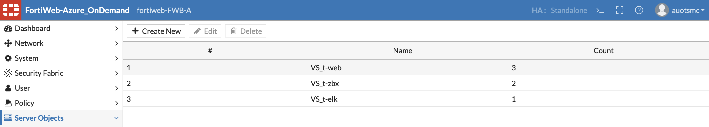
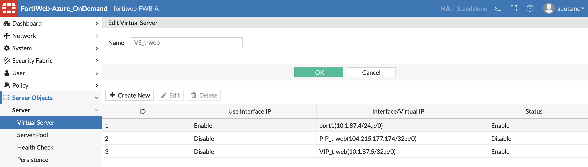
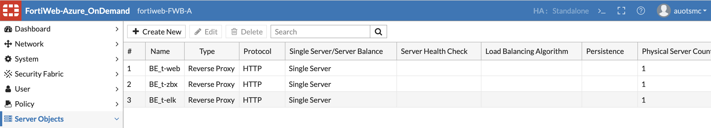
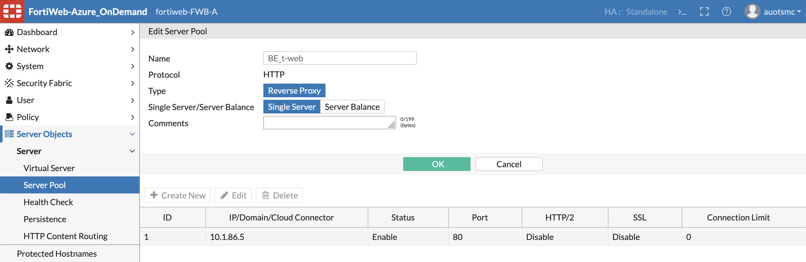
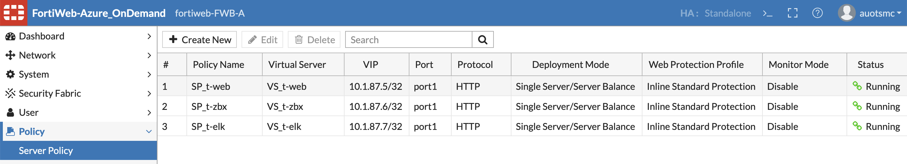

# Firewall before WAF
- Firewall (大門)
    - Internet → Web Public IP → Virtual IP
- Load Balancer (DNAT)
    - Frontend IP → Virtual IP
    - Backend Pools → WAF Instance
    - Load balancing rules
        - Virtual IP → WAF Instance
- WAF (Gateway)
    - 設定外層 IP (WAF)
        - Virtual IP → Load Balancer IP
        - Interface → Port 1
    - Virtual Server
        - Use Interface IP → Enable (至少一個 VS)
    - Server Pool (Web)
        - Type → Reverse Proxy
        - IP → Web IP
    - Route (非必要)
        - 0.0.0.0/0 → Firewall Private IP (Gateway)
- Azure (Rule)
    - NSG Inbound: Internet → Any (VNet 也可以)

# Firewall before WAF (VM Simulation)
- `wget https://raw.githubusercontent.com/sajitsasi/az-ip-fwd/main/ip_fwd.sh`
- `~/ip_fwd.sh -i eth0 -f 80 -a fortiweb -b 80`

# Load Balancer before WAF
- Load Balancer (DNAT)
    - Frontend IP → Virtual IP
    - Backend Pools → WAF Instance
    - Load balancing rules
        - Virtual IP → WAF Instance
- WAF
    - 設定外層 IP (WAF)
        - Virtual IP → Public IP
        - Interface → Port 1
    - Virtual Server
        - Use Interface IP → Enable (至少一個 VS)
    - Server Pool (Web)
        - Type → Reverse Proxy
        - IP → Web IP
- Azure
    - NSG Inbound: Internet → WAF Private IP

# FortiWeb Config
- Interface (default)
     
- Virtual IP
     
- Virtual Server
     
     
- Server Pool
     
     
- Server Policy
     