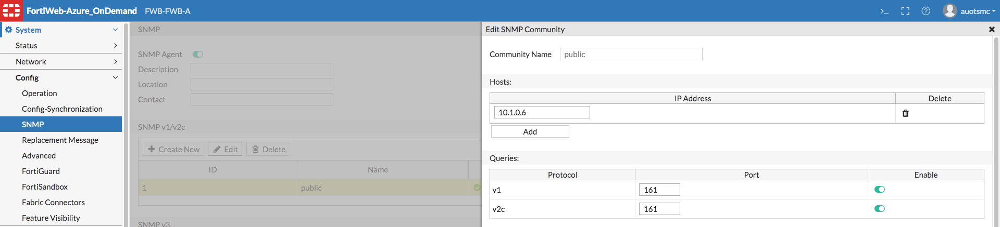

- [Reference](#reference)
- [Architecture](#architecture)
  - [Application Gateway after firewall](#application-gateway-after-firewall)
  - [Topology for Reverse Proxy mode](#topology-for-reverse-proxy-mode)
  - [Topology for either of the transparent modes](#topology-for-either-of-the-transparent-modes)
- [SOP on Azure](#sop-on-azure)
  - [Configure of Firewall](#configure-of-firewall)
  - [Create Interface](#create-interface)
  - [Create Virtual IP](#create-virtual-ip)
  - [Create Virtual Server (WAF Subnet)](#create-virtual-server-waf-subnet)
  - [Create Server Pool (Web Subnet)](#create-server-pool-web-subnet)
  - [Create HTTP Server Policy](#create-http-server-policy)
  - [Create Route](#create-route)
- [Deploy highly available NVAs (Network Virtual Appliances)](#deploy-highly-available-nvas-network-virtual-appliances)
  - [HA architectures overview](#ha-architectures-overview)
  - [SNMP](#snmp)
- [Option](#option)
  - [~~FortoWeb Cloud~~](#fortoweb-cloud)
  - [架構圖](#架構圖)

# Reference
- [Tutorial: Azure Active Directory single sign-on (SSO) integration with FortiWeb Web Application Firewall](https://docs.microsoft.com/en-us/azure/active-directory/saas-apps/fortiweb-web-application-firewall-tutorial)
- [Tutorial: Azure Active Directory single sign-on (SSO) integration with Palo Alto Networks - GlobalProtect](https://docs.microsoft.com/en-us/azure/active-directory/saas-apps/palo-alto-networks-globalprotect-tutorial)
- [Fortinet FortiWeb vs Microsoft Azure Application Gateway comparison](https://www.peerspot.com/products/comparisons/fortinet-fortiweb_vs_microsoft-azure-application-gateway)
- [fortinet/azure-templates](https://github.com/fortinet/azure-templates)
- [FortiWeb on OCB-FE Configuration Guide](https://cloud.orange-business.com/wp-content/uploads/2020/08/FortiWeb_on_OCB_FE_Configuration_Guide.pdf)
- [Configuring FortiWeb-VMs](https://docs.fortinet.com/document/fortiweb-public-cloud/latest/use-case-high-availability-for-fortiweb-on-azure/425287/configuring-fortiweb-vms)
- [Azure Route Server](https://docs.microsoft.com/en-us/azure/architecture/reference-architectures/dmz/nva-ha?tabs=cli#azure-route-server)

# Architecture
## [Application Gateway after firewall](https://docs.microsoft.com/en-us/azure/architecture/example-scenario/gateway/firewall-application-gateway#application-gateway-after-firewall)
 

- [網路虛擬設備 (NVA)](https://aviatrix.com/learn-center/cloud-security/azure-network-virtual-appliance/)
    - NVA is used in the Azure application to enhance HA. It is used as an advanced level of control over traffic flows, such as when building a DMZ in the cloud.
    - 步驟
        - firewall
        - ~~route table~~
            - subnet: web's private IP
            - address prefix: 0.0.0.0/0
            - next hop type: virtual appliance
            - next hop ip address: 10.1.89.4
        - gateway
            - x.x.x.1: reserved by azure for the default gateway
            - [Are there any restrictions on using IP addresses within these subnets?](https://docs.microsoft.com/en-us/azure/virtual-network/virtual-networks-faq#are-there-any-restrictions-on-using-ip-addresses-within-these-subnets)

     

## Topology for Reverse Proxy mode
Requests are destined for a virtual server’s NIC and IP on FortiWeb, **not a web server directly.** FortiWeb usually applies full NAT. FortiWeb applies the first applicable policy, then forwards permitted traffic to a web server. FortiWeb logs, blocks, or modifies violations according to the matching policy.

## Topology for either of the transparent modes
No changes to the IP address scheme of the network are required. **Requests are destined for a web server, not the FortiWeb appliance.** More features are supported than offline protection mode, but fewer than reverse proxy, and may vary if you use HTTPS.

Unlike with Reverse Proxy mode, with both transparent modes, web servers will see the source IP address of clients.
 

# SOP on Azure
 

## Configure of Firewall
- source: *
- destination addresses: web's public IP
- translated address: web's private IP (ex: 10.1.87.4)

 

## Create Interface
在 FortiWeb VM 新增 NIC (ex: FWB-t-web, port 3)
 
 

## Create Virtual IP
The VIPs are the IPs that paired with the domain name of your application. When users visit your application, the destination of their requests are these IPs. (應該是從防火牆進來後需指定的 IP, DNAT)

You can later attach one or more **VIPs** to a virtual server, and then reference the **virtual server** in a **server policy**. The **web protection profile** in the server policy will be applied to all the virtual IPs attached to this virtual server.

- 沒接防火牆，是 Public IP
     
- 有接防火牆，是 Private IP (VIP)
     

## Create Virtual Server (WAF Subnet)
A virtual server is more similar to a VIP on a FortiGate. It is **not** an actual server, but simply defines the listening NIC. Unlike a FortiGate VIP, it includes a specialized proxy that only picks up HTTP and HTTPS. (非真實存在)

By default, in Reverse Proxy mode, FortiWeb’s virtual servers do not forward non-HTTP/HTTPS traffic from virtual servers to your protected web servers. [原文說明](https://docs.fortinet.com/document/fortiweb/6.3.0/administration-guide/219671/configuring-virtual-servers-on-your-fortiweb)

 
- 用 interface，成功 (ex: port 1)
     
     

## Create Server Pool (Web Subnet)
 

## Create HTTP Server Policy
 

## Create Route
Static routes direct traffic exiting the FortiWeb appliance based upon the packet’s destination—you can specify through which NIC a packet leaves and the IP address of a next-hop router that is reachable from that NIC. ([原文說明](https://docs.fortinet.com/document/fortiweb/6.3.0/administration-guide/55130/configuring-the-network-settings))
- You must configure FortiWeb with at **least one static route** that points to a router, often a router that is the gateway to the Internet.
- gateway: x.x.x.1, reserved by azure for the default gateway

 

# Deploy highly available NVAs (Network Virtual Appliances)
- To inspect egress traffic from VMs to the Internet and prevent data exfiltration (滲出).
- To inspect ingress traffic from the Internet to VMs and prevent attacks.
- To filter traffic between VMs in Azure, to prevent lateral moves of compromised systems.
- To filter traffic between on-premises systems and Azure virtual machines, if they are considered to belong to different security levels. (For example, if Azure hosts the DMZ, and on-premises the internal applications.)

## HA architectures overview

## SNMP
 

# Option
## ~~FortoWeb Cloud~~
|       | WaaS                         | VM*                              |
|-------|------------------------------|----------------------------------|
| Type  | SaaS                         | IaaS                             |
| Price | PAYG (traffic)               | PAYG (CPU)                       |
|       | traffic: NT$12/GB            | 2 vCPU: NT$24.9/hr, NT$18,177/mo |
|       | site number: NT$0.9/one site | 8 vCPU: NT$106/hr, NT$77,380/mo  |
- The PAYG license includes a WAF license, a FortiCare subscription (includes Security signatures, IP Reputation and Antivirus) and support
- 還需另外估算 VM & 磁碟費用

## 架構圖
 
 
 
 
 